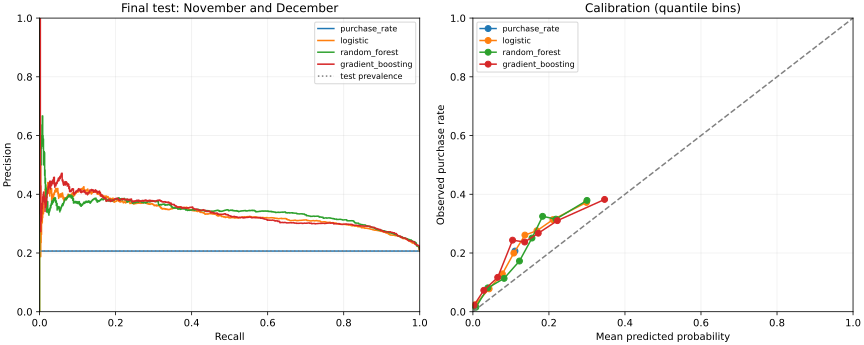

# Elektroninės parduotuvės pirkimo ketinimo tyrimo ataskaita

Andrej Kondratjev, DISfm-26. Intelektualiosios sistemos, 2026–2027 m.

## Pagrindinė išvada

Be neaiškios kilmės prognozės momentu požymio `PageValues` atsitiktinis miškas tik nežymiai pranoko logistinę regresiją. Iš anksto suformuluota hipotezė apie bent 0,02 AP persvarą nepasitvirtino. Tai korektiškas neigiamas rezultatas: modelių ir slenksčių parinkimui galutinis testas nebuvo naudotas. Su `PageValues` gautas daug geresnis rangavimas, bet šio požymio tinkamumas būsimų sesijų realaus laiko prognozei nėra patvirtintas.

Veikianti programa atsisiunčia duomenis, parengia juos, išmoko keturis pagrindinius metodus, atlieka jautrumo bei atsparumo bandymus ir išsaugo tikimybes. Planas, formulės ir literatūra pateikti [kolokviumo plane](KOLIOKVIUMO_PLANAS.md), išankstiniai sprendimai – [protokole](PROTOKOLAS.md).

## Duomenys ir skaidymas

| Imtis | Laikotarpis | Sesijos | Pirkimai | Pirkimų dalis |
|---|---|---:|---:|---:|
| Mokymas | Vasaris–rugpjūtis, turimi mėnesiai | 6 608 | 731 | 11,06 % |
| Validacija | Rugsėjis–spalis | 997 | 201 | 20,16 % |
| Galutinis testas | Lapkritis–gruodis | 4 725 | 976 | 20,66 % |

Iš viso yra 12 330 sesijų, 1 908 pirkimai, 125 visiškai sutampančios eilutės. Jos paliktos: sutampanti suvestinė neįrodo, kad tai tas pats lankytojas. Kadangi pilnas sutapimas apima ir mėnesį, tokios visiškai vienodos eilutės negali patekti į skirtingas šio skaidymo imtis. Vis dėlto pašalinus mėnesį požymių vektoriai tarp imčių gali kartotis; tai nėra nepriklausomai patikrinti lankytojų identifikatoriai.

Pirkimų dažnis mokyme ir teste beveik padvigubėja. Tai realus šio skaidymo poslinkis, o ne atsitiktinio skaidymo triukšmas. Turimas mėnuo leidžia apytikslį laikinį atskyrimą, bet ne tikslų įvykių eiliškumą mėnesio viduje. Laikoma, kad įrašai atitinka UCI aprašytą vienų metų laikotarpį. `Returning_Visitor` nebuvo naudojamas kaip grupės ID.

## Rezultatai

Pagrindinė metrika – AP (average precision). Trapecinis PR-AUC taip pat pateiktas visoje [automatinėje rezultatų lentelėje](../results/RESULTS.md), tačiau šios dvi metrikos nėra tapačios. Visi pagrindiniai modeliai naudoja tas pačias eilutes ir 15 tų pačių pradinių požymių. RF parinktas minimalus lapas 20, logistinei regresijai C=1, stiprinimui – 7 lapai.

| Modelis be PageValues | AP | Precision | Recall | Brier |
|---|---:|---:|---:|---:|
| Mokymo pirkimų dažnis | 0,2066 | 0,2066 | 1,0000 | 0,1731 |
| Logistinė regresija | 0,3336 | 0,2438 | 0,9693 | 0,1582 |
| Atsitiktinis miškas | 0,3411 | 0,2414 | 0,9795 | 0,1555 |
| Gradientinis stiprinimas | 0,3392 | 0,2311 | 0,9877 | 0,1572 |

RF–logistinės regresijos AP skirtumas yra 0,0076; porinio bootstrap 95 % intervalas [−0,0113; 0,0284]. Intervalas apima nulį, todėl šis bandymas neleidžia tvirtai teigti, kad RF geresnis. Intervalas sąlyginis šiai testo imčiai ir jau išmokytiems modeliams: neapima kitų mokymo sėklų, ateities mėnesių ar kitų parduotuvių neapibrėžtumo.

RF AP ir Brier skaičiais geriausi iš pagrindinių metodų, bet persvara nedidelė. Galimas paaiškinimas – likusiuose elgsenos požymiuose nedaug papildomo netiesinio signalo ir ryškus laikotarpio poslinkis. Tai interpretacija, ne eksperimentiškai nustatyta priežastis. Mažas parametrų tinklas neįrodo, kad geriausia įmanoma RF ar stiprinimo versija jau rasta.

**Svarbi PR-AUC išimtis.** Pastovus modelis suteikia visoms sesijoms vienodą tikimybę. Jo AP lygi testo pirkimų daliai 0,2066. Trapecinis integravimas su PR galiniu tašku (recall=0, precision=1) duoda 0,6033, nors modelis sesijų neranguoja. Todėl metodai parenkami ir lyginami pagal AP, o trapecinis dydis nerodomas kaip pastovaus modelio pranašumas.

## Slenkstis ir klaidų kaina

RF validacijoje parinktas slenkstis 0,03, logistinei regresijai – 0,04. Žemi slenksčiai didina recall. RF testas: TP=956, FP=3 004, FN=20, TN=745. Iš 3 960 teigiamų prognozių tik 956 yra tikri pirkimai. Taigi 97,95 % recall nėra 97,95 % bendras tikslumas. Didelė FP apimtis riboja modelio tinkamumą brangiems kontaktams ar nuolaidoms.

Pastoviam modeliui slenksčio tinklelio pirmas maksimumas 0,01 nulemia, kad visos sesijos laikomos teigiamomis. Tai sąžiningas pasirinktos F2 taisyklės rezultatas, kartu atskleidžiantis jos ribą. Tikrame diegime reikėtų nustatyti veiksmų biudžetą arba tikras FP ir FN kainas, o slenkstį iš naujo parinkti atskiroje būsimo laikotarpio validacijoje.

## Kalibracija

Brier yra vidutinė kvadratinė tikimybės paklaida; mažesnė vertė geresnė, tačiau ši metrika atspindi ir kitus tikimybinės prognozės aspektus, ne vien kalibraciją. Papildomai pateikta patikimumo kreivė su aštuoniomis apytiksliai vienodo dydžio grupėmis. Pastovus modelis turi vieną tašką.

RF dažniausiai nuvertina pirkimų tikimybę: vienoje grupėje vidutiniškai prognozuoja 0,183, o perkama 0,325 atvejų; aukščiausioje grupėje – 0,300 ir 0,379. Tai dera su didesniu pirkimų dažniu vėlesniais mėnesiais, tačiau vien šis ryšys neįrodo priežasties. Papildomas kalibratorius nebuvo mokytas; kalibracija čia įvertinta, o ne pažadėta. Būsimas gerinimas – atskiras vėlesnio laikotarpio kalibravimo rinkinys ir naujas neliečiamas testas.

## Požymio jautrumas ir atsparumas

Pridėjus `PageValues`, RF AP pakilo iki 0,6715, Brier sumažėjo iki 0,1158. Abiem RF taikytas toks pats dviejų kandidatų tinklas; su šiuo požymiu validacija pasirinko lapo dydį 5. Todėl tai požymių rinkinio jautrumo bandymas su vienodu parinkimo biudžetu, o ne grynas vieno požymio efektas užfiksavus visus parametrus. Rezultatas rodo didelę priklausomybę nuo šio signalo. Nei pats pakilimas, nei jo dydis neįrodo nutekėjimo. Reikėtų patikrinti rodiklio apskaičiavimo langą ir ar nebuvo naudota dabartinė ar būsima transakcija. Pagrindinės išvados remiasi variantu be jo.

Atsparumo bandyme ta pati atsitiktinė kaukė pašalino 4 197 skaitines reikšmes iš 42 525 (9,87 %, nustatyta tikimybė 10 %). Transformacijos ir slenksčiai liko užfiksuoti. RF AP sumažėjo nuo 0,3411 iki 0,3386, logistinės regresijos – nuo 0,3336 iki 0,3298, stiprinimo – nuo 0,3392 iki 0,3360. Taigi atsitiktiniam nedidelės dalies langelių praradimui šios realizacijos gana atsparios. Bandymas neapima viso stulpelio dingimo ar nuo klasės priklausančio duomenų trūkumo.

## Klaidų pavyzdžiai

Pilni įrašai pateikti [error_examples.csv](../results/error_examples.csv). `source_row` yra nulinis duomenų eilutės indeksas, ne naudotojo ID ir ne fizinis CSV eilutės numeris.

| Eilutė | Klaida | Tikimybė | Stebimas elgesys |
|---|---|---:|---|
| 10064 | FP | 0,4595 | 23 produktų puslapiai, apie 1 216 s, mažas ExitRates, bet nepirkta |
| 11145 | FP | 0,4551 | 17 produktų puslapių, apie 935 s, naujas lankytojas, bet nepirkta |
| 10615 | FN | 0,0011 | 3 produktų puslapiai, apie 71 s, vis dėlto pirkta |
| 7600 | FN | 0,0052 | 3 produktų puslapiai, nulinė trukmė ir dideli išėjimo rodikliai, vis dėlto pirkta |

Intensyvus naršymas nebūtinai baigiasi pirkimu, o trumpa sesija nebūtinai reiškia nesusidomėjimą. Nulinė trukmė su pirkimu taip pat motyvuoja išsiaiškinti analitikos matavimo taisykles. Tikros individualios motyvacijos šiuose duomenyse nėra, todėl jos nepriskiriame.

Lapkričio RF AP=0,3868, gruodžio=0,2900; pirkimų dalys atitinkamai 25,35 % ir 12,51 %. AP priklauso nuo klasės dažnio, todėl šių skaičių negalima laikyti grynu modelio kokybės pablogėjimo matu. Naujų lankytojų grupėje žemas slenkstis visas 754 sesijas priskyrė teigiamai klasei. Mažos grupės `Other` rezultatai (84 eilutės) nestabilūs. Pilna suvestinė – [subgroups.csv](../results/subgroups.csv).

## Atkuriamumas ir patikrinimai

Pagrindinis paleidimas truko apie 6,45 s autoriaus Windows CPU aplinkoje; kitame kompiuteryje trukmė skirsis. Priklausomybės fiksuotos, Python 3.12, sėkla 42, skaičiavimo srautų skaičius 1. Duomenys patikrinti SHA256. [manifest.json](../results/manifest.json) fiksuoja aplinką, parametrus, šaltinio kodo kontrolines sumas ir patikras. RF medžių tikimybių vidurkio ir bibliotekos išvesties didžiausias skirtumas visame teste buvo 0.

Aštuoni automatiniai testai tikrina laiko tvarką, imčių atskyrimą, neleistinų požymių pašalinimą, mokymo medianas, naujas kategorijas ir tuščias reikšmes, RF formulę, AP savybę, slenkstį, blogą įvestį bei UTF-8 rezultatų įrašymą. Jie neįrodo visos sistemos nepriekaištingumo, bet tikrina svarbiausias šio tyrimo klaidų vietas.

## Praktinis tinkamumas ir tolesnis darbas

Pateikta veikianti mokomoji sesijų klasifikavimo sistema. Realaus laiko diegimui dar reikia įvykių laiko žymų, požymių momentinių kopijų iki prognozės, patikrintos analitinių agregatų kilmės, būsimo laikotarpio testo ir intervencijų kaštų. Net pašalinus `PageValues`, sesijos galutinės trukmės bei `BounceRates` ir `ExitRates` prieinamumas turi būti audituojamas. Be tokio audito negalima teigti, kad nutekėjimas visiškai pašalintas.

Gyvas gynimas ir dėstytojo tikrai nematytas bandymas šiame darbe dar neįvyko. Jiems paruošta programa bei [gynimo instrukcija](GYNIMAS.md); šios dalies balų ar sėkmės negalima laikyti jau pasiektais.
