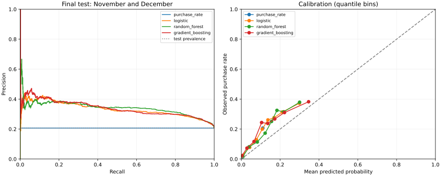

# Elektroninės parduotuvės pirkimo ketinimo tyrimo ataskaita

Andrej Kondratjev, DISfm-26. Intelektualiosios sistemos, 2026–2027 m.

## Pagrindinė išvada

Be neaiškios kilmės prognozės momentu požymio `PageValues` atsitiktinis miškas tik nežymiai pranoko logistinę regresiją. Iš anksto suformuluota hipotezė apie bent 0,02 AP persvarą nepasitvirtino. Tai korektiškas neigiamas rezultatas: modelių ir slenksčių parinkimui galutinis testas nebuvo naudotas. Su `PageValues` gautas daug geresnis rangavimas, bet šio požymio tinkamumas būsimų sesijų realaus laiko prognozei nėra patvirtintas.

Veikianti programa atsisiunčia duomenis, parengia juos, išmoko keturis pagrindinius metodus, atlieka jautrumo bei atsparumo bandymus ir išsaugo tikimybes. Planas, formulės ir literatūra pateikti [kolokviumo plane](KOLIOKVIUMO_PLANAS.md), išankstiniai sprendimai – [protokole](PROTOKOLAS.md).

## Duomenys ir skaidymas

| Imtis | Laikotarpis | Sesijos | Pirkimai | Pirkimų dalis |
|---|---|---:|---:|---:|
| Mokymas | Vasaris–rugpjūtis, turimi mėnesiai | 6 608 | 731 | 11,06 % |
| Validacija | Rugsėjis–spalis | 997 | 201 | 20,16 % |
| Galutinis testas | Lapkritis–gruodis | 4 725 | 976 | 20,66 % |

Iš viso yra 12 330 sesijų, 1 908 pirkimai, 125 visiškai sutampančios eilutės. Jos paliktos: sutampanti suvestinė neįrodo, kad tai tas pats lankytojas. Kadangi pilnas sutapimas apima ir mėnesį, tokios visiškai vienodos eilutės negali patekti į skirtingas šio skaidymo imtis. Vis dėlto pašalinus mėnesį požymių vektoriai tarp imčių gali kartotis; tai nėra nepriklausomai patikrinti lankytojų identifikatoriai.

Pirkimų dažnis mokyme ir teste beveik padvigubėja. Tai realus šio skaidymo poslinkis, o ne atsitiktinio skaidymo triukšmas. Turimas mėnuo leidžia apytikslį laikinį atskyrimą, bet ne tikslų įvykių eiliškumą mėnesio viduje. Laikoma, kad įrašai atitinka UCI aprašytą vienų metų laikotarpį. `Returning_Visitor` nebuvo naudojamas kaip grupės ID.

Lapkričio–gruodžio imtis buvo validus nepriklausomas galutinis testas pirmojo vertinimo metu, nes modeliai, hiperparametrai ir slenksčiai buvo užfiksuoti prieš jį atveriant. Po to ši imtis panaudota klaidų, pogrupių, kalibracijos ir slenksčio elgsenos analizei, todėl dabar jos rezultatai tyrėjui žinomi. Vėlesni modelio pakeitimai nebegali būti laikomi nepriklausomai patvirtintais tame pačiame teste: jiems reikia naujo būsimo laikotarpio arba kitos iki tol neliestos *holdout* imties.

## Rezultatai

Pagrindinė metrika – AP (average precision). Trapecinis PR-AUC taip pat pateiktas visoje [automatinėje rezultatų lentelėje](../results/RESULTS.md), tačiau šios dvi metrikos nėra tapačios. Visi pagrindiniai modeliai naudoja tas pačias eilutes ir 15 tų pačių pradinių požymių. Atliktas ribotas hiperparametrų palyginimas validacijos imtyje, o ne išsami hiperparametrų optimizacija: logistinei regresijai `C ∈ {0,1; 1,0}`, RF `min_samples_leaf ∈ {5; 20}`, stiprinimui `max_leaf_nodes ∈ {7; 15}`. RF parinktas minimalus lapas 20, logistinei regresijai C=1, stiprinimui – 7 lapai.

| Modelis be PageValues | AP | Precision | Recall | Brier |
|---|---:|---:|---:|---:|
| Mokymo pirkimų dažnis | 0,2066 | 0,2066 | 1,0000 | 0,1731 |
| Logistinė regresija | 0,3336 | 0,2438 | 0,9693 | 0,1582 |
| Atsitiktinis miškas | 0,3411 | 0,2414 | 0,9795 | 0,1555 |
| Gradientinis stiprinimas | 0,3392 | 0,2311 | 0,9877 | 0,1572 |

RF–logistinės regresijos AP skirtumas yra 0,0076; porinio bootstrap 95 % intervalas [−0,0113; 0,0284]. Intervalas apima nulį, todėl šis bandymas neleidžia tvirtai teigti, kad RF geresnis. Intervalas sąlyginis šiai testo imčiai ir jau išmokytiems modeliams: neapima kitų mokymo sėklų, ateities mėnesių ar kitų parduotuvių neapibrėžtumo.

RF AP ir Brier skaičiais geriausi iš pagrindinių metodų, bet persvara nedidelė. Galimas paaiškinimas – likusiuose elgsenos požymiuose nedaug papildomo netiesinio signalo ir ryškus laikotarpio poslinkis. Tai interpretacija, ne eksperimentiškai nustatyta priežastis. Mažas parametrų tinklas neįrodo, kad geriausia įmanoma RF ar stiprinimo versija jau rasta.

**Svarbi PR-AUC išimtis.** Pastovus modelis suteikia visoms sesijoms vienodą tikimybę. Jo AP lygi testo pirkimų daliai 0,2066. Trapecinis integravimas su PR galiniu tašku (recall=0, precision=1) duoda 0,6033, nors modelis sesijų neranguoja. Todėl metodai parenkami ir lyginami pagal AP, o trapecinis dydis nerodomas kaip pastovaus modelio pranašumas.

## Slenkstis ir klaidų kaina

RF validacijoje parinktas slenkstis 0,03, logistinei regresijai – 0,04. Žemi slenksčiai didina recall. RF testas: TP=956, FP=3 004, FN=20, TN=745. Iš 3 960 teigiamų prognozių tik 956 yra tikri pirkimai. Taigi 97,95 % recall nėra 97,95 % bendras tikslumas. Didelė FP apimtis riboja modelio tinkamumą brangiems kontaktams ar nuolaidoms.

Pastoviam modeliui slenksčio tinklelio pirmas maksimumas 0,01 nulemia, kad visos sesijos laikomos teigiamomis. Tai sąžiningas pasirinktos F2 taisyklės rezultatas, kartu atskleidžiantis jos ribą. Tikrame diegime reikėtų nustatyti veiksmų biudžetą arba tikras FP ir FN kainas, o slenkstį iš naujo parinkti atskiroje būsimo laikotarpio validacijoje.

## Kalibracija

Brier yra vidutinė kvadratinė tikimybės paklaida; mažesnė vertė geresnė, tačiau ši metrika atspindi ir kitus tikimybinės prognozės aspektus, ne vien kalibraciją. Papildomai pateikta patikimumo kreivė su aštuoniomis apytiksliai vienodo dydžio grupėmis. Pastovus modelis turi vieną tašką.

RF dažniausiai nuvertina pirkimų tikimybę: vienoje grupėje vidutiniškai prognozuoja 0,183, o perkama 0,325 atvejų; aukščiausioje grupėje – 0,300 ir 0,379. Tai dera su didesniu pirkimų dažniu vėlesniais mėnesiais, tačiau vien šis ryšys neįrodo priežasties. Papildomas kalibratorius nebuvo mokytas; kalibracija čia įvertinta, o ne pažadėta. Būsimas gerinimas – atskiras vėlesnio laikotarpio kalibravimo rinkinys ir naujas neliečiamas testas.

## Požymio jautrumas ir atsparumas

Pridėjus `PageValues`, validacijoje parinkto RF testo AP pakilo iki 0,6715, Brier sumažėjo iki 0,1158. Abiem RF taikytas toks pats dviejų kandidatų tinklas, bet be šio požymio validacija pasirinko lapo dydį 20, o su juo – 5. Todėl šis palyginimas kartu atspindi požymio pridėjimą ir pakartotinį hiperparametro parinkimą.

Papildoma fiksuotų parametrų abliacija atskiria šiuos veiksnius; kiekvienoje eilutėje keičiamas tik `PageValues` įtraukimas, o testo rezultatas nenaudojamas jokiam variantui pasirinkti:

| `min_samples_leaf` | `PageValues` | Validacijos AP | Testo AP |
|---:|:---:|---:|---:|
| 5 | ne | 0,3063 | 0,3345 |
| 5 | taip | 0,7070 | 0,6715 |
| 20 | ne | 0,3070 | 0,3411 |
| 20 | taip | 0,6904 | 0,6611 |

Abiem fiksuotais lapo dydžiais `PageValues` susijęs su dideliu AP padidėjimu, bet nei pats pakilimas, nei jo dydis neįrodo nutekėjimo ar saugaus prieinamumo. Ši abliacija atlikta jau po pirminės galutinio testo analizės, todėl yra tiriamoji analizė, o ne naujas nepriklausomas modelio kokybės patvirtinimas. Pagrindinės išvados ir pagrindiniai rezultatai lieka paremti iš anksto numatytu variantu be `PageValues`.

Atsparumo bandyme ta pati atsitiktinė kaukė pašalino 4 197 skaitines reikšmes iš 42 525 (9,87 %, nustatyta tikimybė 10 %). Transformacijos ir slenksčiai liko užfiksuoti. RF AP sumažėjo nuo 0,3411 iki 0,3386, logistinės regresijos – nuo 0,3336 iki 0,3298, stiprinimo – nuo 0,3392 iki 0,3360. Taigi atsitiktiniam nedidelės dalies langelių praradimui šios realizacijos gana atsparios. Bandymas neapima viso stulpelio dingimo ar nuo klasės priklausančio duomenų trūkumo.

## Klaidų pavyzdžiai

Pilni įrašai pateikti [error_examples.csv](../results/error_examples.csv). `source_row` yra nulinis duomenų eilutės indeksas, ne naudotojo ID ir ne fizinis CSV eilutės numeris.

| Eilutė | Klaida | Tikimybė | Stebimas elgesys |
|---|---|---:|---|
| 10064 | FP | 0,4595 | 23 produktų puslapiai, apie 1 216 s, mažas ExitRates, bet nepirkta |
| 11145 | FP | 0,4551 | 17 produktų puslapių, apie 935 s, naujas lankytojas, bet nepirkta |
| 10615 | FN | 0,0011 | 3 produktų puslapiai, apie 71 s, vis dėlto pirkta |
| 7600 | FN | 0,0052 | 3 produktų puslapiai, nulinė trukmė ir dideli išėjimo rodikliai, vis dėlto pirkta |

Intensyvus naršymas nebūtinai baigiasi pirkimu, o trumpa sesija nebūtinai reiškia nesusidomėjimą. Nulinė trukmė su pirkimu taip pat motyvuoja išsiaiškinti analitikos matavimo taisykles. Tikros individualios motyvacijos šiuose duomenyse nėra, todėl jos nepriskiriame.

Lapkričio RF AP=0,3868, gruodžio=0,2900; pirkimų dalys atitinkamai 25,35 % ir 12,51 %. AP priklauso nuo klasės dažnio, todėl šių skaičių negalima laikyti grynu modelio kokybės pablogėjimo matu. Naujų lankytojų grupėje žemas slenkstis visas 754 sesijas priskyrė teigiamai klasei. Mažos grupės `Other` rezultatai (84 eilutės) nestabilūs. Pilna suvestinė – [subgroups.csv](../results/subgroups.csv).

## Atkuriamumas ir patikrinimai

Pagrindinis paleidimas truko apie 6,45 s autoriaus Windows CPU aplinkoje; kitame kompiuteryje trukmė skirsis. Priklausomybės fiksuotos, Python 3.12, sėkla 42, skaičiavimo srautų skaičius 1. Duomenys patikrinti SHA256. [manifest.json](../results/manifest.json) fiksuoja pradinio pagrindinio paleidimo aplinką, parametrus, to meto šaltinio kodo kontrolines sumas ir patikras; po papildomos abliacijos kodo pakeitimo šios sumos nebeturi sutapti su dabartiniais `src/` failais. Atskirame pakartotiniame paleidime visi pagrindinių variantų AP tiksliai sutapo su išsaugotais rezultatais. RF medžių tikimybių vidurkio ir bibliotekos išvesties didžiausias skirtumas visame teste buvo 0.

Keturiolika automatinių testų tikrina laiko tvarką, imčių atskyrimą, neleistinų požymių pašalinimą, mokymo medianas, naujas kategorijas ir tuščias reikšmes, RF formulę, AP savybę, slenkstį, blogą įvestį bei UTF-8 rezultatų įrašymą. Šeši iš jų papildomai tikrina išplėstinį laikinį derinimą. Testai neįrodo visos sistemos nepriekaištingumo, bet tikrina svarbiausias šio tyrimo klaidų vietas.

## Praktinis tinkamumas ir tolesnis darbas

Šis eksperimentas aiškiai apibrėžiamas kaip užbaigtų sesijų suvestinių *offline/post-session* klasifikavimas. UCI aprašymas nurodo, kad puslapių skaičius ir trukmė gali būti atnaujinami naršant, tačiau pateiktas CSV neturi tarpinių momentinių kopijų ir neįrodo, kokios galutinės reikšmės buvo žinomos konkrečiu realaus laiko prognozės momentu.

| Požymis | Ką reiškia | Kada atsiranda | Ar garantuotas tarpiniu prognozės momentu? | Sesijos pabaigos informacijos rizika |
|---|---|---|---|---|
| `Administrative` | administracinių puslapių skaičius | kaupiasi naršant | tik dalinė reikšmė; galutinė negarantuota | vidutinė |
| `Administrative_Duration` | laikas administraciniuose puslapiuose | kaupiasi naršant | galutinė reikšmė negarantuota | vidutinė |
| `Informational` | informacinių puslapių skaičius | kaupiasi naršant | tik dalinė reikšmė; galutinė negarantuota | vidutinė |
| `Informational_Duration` | laikas informaciniuose puslapiuose | kaupiasi naršant | galutinė reikšmė negarantuota | vidutinė |
| `ProductRelated` | produktų puslapių skaičius | kaupiasi naršant | tik dalinė reikšmė; galutinė negarantuota | vidutinė |
| `ProductRelated_Duration` | laikas produktų puslapiuose | kaupiasi per visą sesiją | ne; galutinė trukmė priklauso nuo vėlesnio naršymo | **didelė** |
| `BounceRates` | aplankytų puslapių atmetimo rodiklių agregatas | analitikos sistemoje ir agreguojant aplankytus puslapius | CSV momentinės reikšmės neįrodo | **didelė** |
| `ExitRates` | aplankytų puslapių išėjimo rodiklių agregatas | analitikos sistemoje ir agreguojant aplankytus puslapius | CSV momentinės reikšmės neįrodo | **didelė** |
| `SpecialDay` | datos artumas specialiai dienai | žinomas iš kalendoriaus prieš sesiją | taip | maža |
| `PageValues` | aplankytų puslapių komercinės vertės agregatas | analitikos sistemoje; tikslus skaičiavimo langas CSV neatskleistas | neįrodyta | **labai didelė** |

Pateikta veikianti mokomoji sesijų klasifikavimo sistema. Realaus laiko diegimui dar reikia įvykių laiko žymų, požymių momentinių kopijų iki prognozės, patikrintos analitinių agregatų kilmės, būsimo laikotarpio testo ir intervencijų kaštų. Tiesioginis `Revenue` nepatenka į įvestį, o `PageValues` pašalintas iš pagrindinio varianto, tačiau vien tai neįrodo, kad temporalinis informacijos nutekėjimas visiškai pašalintas: galutinės trukmės, `BounceRates` ir `ExitRates` taip pat turi būti audituojami.

Gyvas gynimas ir dėstytojo tikrai nematytas bandymas šiame darbe dar neįvyko. Jiems paruošta programa bei [gynimo instrukcija](GYNIMAS.md); šios dalies balų ar sėkmės negalima laikyti jau pasiektais.

## Išplėstinis hiperparametrų tyrimas

Viena komanda `python -m src.experiment` po pirminio eksperimento ir `PageValues` analizės atliko atskirą **post-test exploratory** paiešką. Keturi didėjantys laiko foldai tikrino vėlesnį mėnesį po ankstesnių: vasaris–kovas → gegužė, tada papildomai gegužė → birželis, papildomai birželis → liepa ir papildomai liepa → rugpjūtis. Kiekvieno foldo paruošimas mokytas tik jo train dalyje. `Revenue`, `Month` ir `PageValues` į įvestį nepateko. Patikrintos 722 unikalios konfigūracijos: 22 LR, 250 RF, 200 histograminių GB ir 250 XGBoost; atlikti 3372 modelių mokymai. Kandidatai lyginti pagal vidutinę keturių foldų AP, o 10 geriausių kiekvienos šeimos variantų papildomai vertinti dėl stabilumo. Po to po vieną variantą mokyta vasario–rugpjūčio duomenimis ir palyginta rugsėjo–spalio validacijoje.

| Šeima | Temporal AP, vidurkis ± SD | Rugsėjo–spalio AP | Lapkričio–gruodžio AP, tiriamasis |
|---|---:|---:|---:|
| Logistinė regresija | 0,2397 ± 0,0623 | 0,2464 | 0,3360 |
| Atsitiktinis miškas | 0,2852 ± 0,0326 | **0,3052** | 0,3325 |
| Histograminis GB | 0,2876 ± 0,0216 | 0,2920 | 0,3380 |
| XGBoost | 0,2892 ± 0,0149 | 0,2863 | 0,3407 |

Rugsėjo–spalio AP pasirinko atsitiktinį mišką: 200 medžių, `criterion=entropy`, `min_samples_leaf=2`, `min_samples_split=20`, `max_features=sqrt`, be gylio ribos ir klasės svorių. Jo F2 slenkstis 0,01 nustatytas toje pačioje validacijoje. Po užfiksuoto pasirinkimo Nov–Dec AP buvo 0,3325, Brier 0,1563, precision 0,2303, recall 0,9908 ir F2 0,5967. Pradinio RF AP 0,3411 buvo didesnė 0,0087. Išplėstinė paieška neparodė paslėpto AP pagerėjimo; tai leidžia svarstyti duomenų ir požymių ribas, bet neįrodo jų priežastinio poveikio.

XGBoost Nov–Dec AP 0,3407 buvo aukštesnė už naujai parinkto RF 0,3325, tačiau jo rugsėjo–spalio AP buvo tik 0,2863. Testo rezultatu perrinkti šeimą būtų neteisinga. Be to, XGBoost Brier 0,2196 ir log loss 0,6149 buvo blogesni už pradinio RF 0,1555 ir 0,4781. Visos konfigūracijos, stabilumo rezultatai, pasirinkimai ir grafikai pateikti [`results/tuning/`](../results/tuning/SUMMARY.md). Nov–Dec jau buvo analizuotas ankstesniuose darbo etapuose, todėl net be testu grindžiamo pasirinkimo naujas vertinimas nėra nepriklausomas patvirtinimas; jam reikėtų būsimo arba iki tol neliesto laikotarpio.

## AI naudojimo auditas

ChatGPT Codex padėjo įgyvendinti kodą, rengti dokumentaciją ir tikrinti rezultatus. Svarbiausios užklausos apėmė pradinį sprendimą, požymių laikinį auditą, PageValues abliaciją, papildomą metodų bei parametrų tyrimą ir galutinę patikrą. Studentas pats paleido išplėstinį eksperimentą savo kompiuteryje; AI patikrino išsaugotus rezultatus.

Priimti pasiūlymai: laikinis skaidymas, tik train išmokstamas Pipeline, baseline, RF ir gradientinis stiprinimas, atskiras XGBoost bandymas. Atmestos prielaidos, kad sudėtingesnis modelis būtinai geresnis, kad slenkstį galima rinktis pagal testą ir kad sesijų suvestinių rezultatas įrodo realaus laiko tinkamumą. SMOTE su atranka ir stacking netaikyti dėl papildomo sudėtingumo.

Aptiktos AI klaidos ir prielaidos bei jų patikra:

- Iš pradžių nepatikrinus nurodyta SciPy 1.16.3. Faktinės aplinkos versija buvo 1.17.0; priklausomybių sąrašas pataisytas.
- AP ir trapecinio PR-AUC sutapatinimas būtų klaida: baseline trapecinis plotas 0,6033, bet AP 0,2066. Skaičiai perskaičiuoti, metrikos atskirtos ir pridėtas konstantinių prognozių AP testas.
- PageValues saugumas ar nutekėjimas neįrodomas vien pavadinimu. Tikrinti UCI aprašymas ir fiksuotų parametrų abliacija; laikinė kilmė iš CSV liko nepatvirtinta.

14 unit testų baigėsi OK; RF formulės skirtumas nuo bibliotekos išvesties buvo 0. Pagrindinės metrikos ir bootstrap sutikrinti su išsaugotomis prognozėmis. Išsamūs įrašai pateikti [AI žurnale](AI_ZURNALAS.md). Gyvas gynimas, dėstytojo nematytas bandymas ir savarankiškas pakeitimas lieka studentui.
