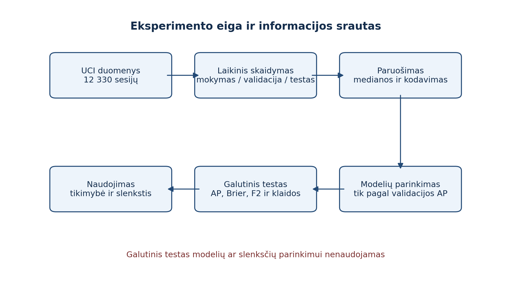
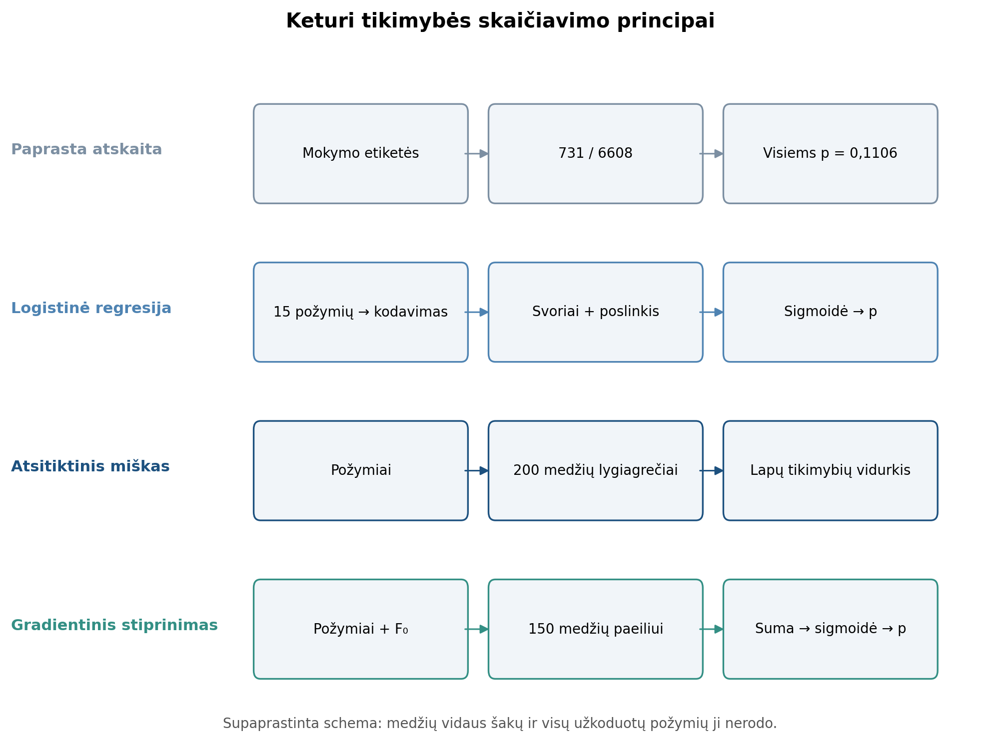
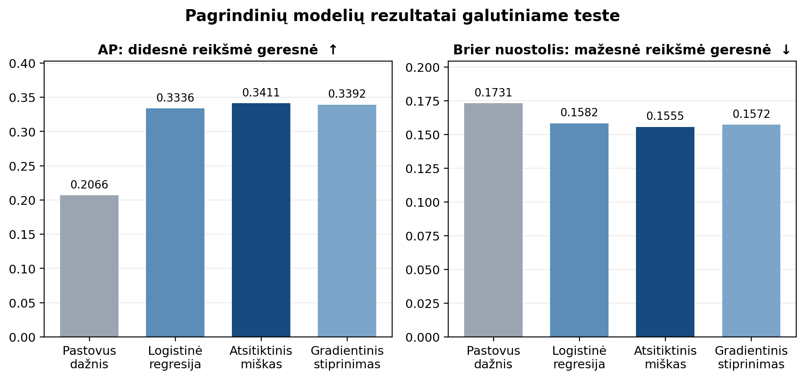
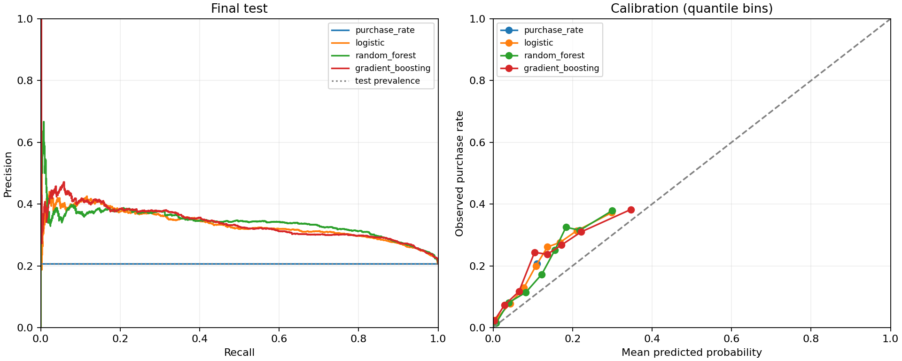

# Elektroninės parduotuvės pirkimo ketinimo tyrimo egzamino ataskaita

**Andrej Kondratjev · DISfm-26 · Intelektualiosios sistemos · 2026**

## 1. Įvadas

Šioje ataskaitoje aprašomas elektroninės parduotuvės sesijos pirkimo ketinimo tyrimas: duomenų gavimas ir paruošimas, modelių mokymas, parinkimas, galutinis vertinimas, klaidų analizė ir praktinio naudojimo ribos. Tyrimo tikslas – pagal užbaigtų sesijų suvestines apskaičiuoti pirkimo tikimybės įvertį ir palyginti, ar atsitiktinis miškas suteikia praktiškai pastebimą pranašumą prieš paprastesnes atskaitas. Šio bandymo požymių prieinamumas dar vykstant naršymui nepatvirtintas. Ataskaitoje pateikiami jau įvykdyto eksperimento rezultatai; visas programos kodas nekartojamas.

Praktinė vertė – galimybė rikiuoti sesijas pagal tikėtiną pirkimą ir nukreipti ribotus veiksmus, pavyzdžiui, konsultanto dėmesį ar priminimą. Prognozė pati savaime nenusako, kokį veiksmą taikyti: tam dar reikia žinoti klaidingo teigiamo sprendimo, praleisto pirkėjo ir intervencijos kainą.

### 1.1. Tyrimo klausimas ir hipotezė

Pagrindinis klausimas: ar modelis, gebantis aprašyti netiesines požymių sąveikas, vėlesnių mėnesių sesijas surikiuoja geriau už logistinę regresiją? Iš anksto nustatyta H1 hipotezė: nenaudojant neaiškaus prieinamumo požymio PageValues, atsitiktinio miško galutinio testo AP turi būti bent 0,02, t. y. 2 procentiniais punktais, didesnė už logistinės regresijos AP. 0,02 riba yra projekto minimalus praktiškai pastebimas pagerėjimas, o ne literatūroje garantuotas efektas.

## 2. Duomenys ir jų paruošimas

Naudotas UCI Online Shoppers Purchasing Intention duomenų rinkinys (Sakar ir Kastro, 2018). Viena eilutė yra anoniminė internetinės parduotuvės sesijos suvestinė, o tikslas Revenue nurodo, ar sesija baigėsi pirkimu. Rinkinyje yra 12 330 sesijų ir 1 908 pirkimai. Lankytojo identifikatoriaus bei tikslių laiko žymų nėra, todėl mėnuo taikomas tik apytiksliam laikiniam atskyrimui.

**1 lentelė. Laikinis duomenų skaidymas**

| Imtis | Mėnesiai | Sesijos | Pirkimai | Pirkimų dalis |
|---|---|---|---|---|
| Mokymas | Vasaris–rugpjūtis | 6 608 | 731 | 11,06 % |
| Validacija | Rugsėjis–spalis | 997 | 201 | 20,16 % |
| Galutinis testas | Lapkritis–gruodis | 4 725 | 976 | 20,66 % |

Skaidymas sąmoningai imituoja mokymą iš ankstesnių mėnesių ir vertinimą vėlesniu laikotarpiu. Mokymo imties medianos, kategorijų žodynas ir kitos transformacijos apskaičiuojamos tik iš mokymo dalies. Skaitinės tuščios reikšmės pakeičiamos mokymo mediana, kategorinės – mokyme dažniausia reikšme, o kategorijos koduojamos vienkartiniu kodavimu (angl. *one-hot encoding*). Nežinomos vėlesnių imčių kategorijos priimamos be klaidos.

Pagrindiniame variante naudojama 15 pradinių požymių. PageValues pašalintas, nes jo apskaičiavimo momentas duomenų apraše nėra pakankamai aiškus realaus laiko prognozei. Šis požymis grąžinamas tik atskirame jautrumo bandyme. Visiškai sutampančios 125 eilutės paliktos, nes suvestinės sutapimas neįrodo, kad tai tas pats lankytojas; jos dėl mėnesio negali kirsti pasirinkto skaidymo ribų.

## 3. Metodai ir eksperimento protokolas

**2 lentelė. Lyginti metodai**

| Metodas | Paskirtis | Parinkti nustatymai |
|---|---|---|
| Pastovus mokymo dažnis | Paprasta atskaita; visoms sesijoms ta pati tikimybė | p = 0,1106 |
| Logistinė regresija | Stipresnė interpretuojama tiesinė atskaita | C = 1 |
| Atsitiktinis miškas | Netiesinės sąveikos ir kelių medžių vidurkis | 200 medžių; min. lapas 20 |
| Gradientinis stiprinimas | Nuosekliai taisomos ankstesnių medžių klaidos | 150 iteracijų; 7 lapai |

Iš viso validacijoje išbandyti 9 iš anksto apibrėžti kandidatai: viena pastovi atskaita, dvi logistinės regresijos, dvi atsitiktinio miško, dvi gradientinio stiprinimo ir dvi atsitiktinio miško su PageValues versijos. Kiekvienoje metodų šeimoje laimėtojas parinktas tik pagal validacijos AP. Galutinis testas iki pasirinkimų užfiksavimo nenaudotas.



*1 pav. Eksperimento eiga ir duomenų atskyrimo principas*

### 3.1. Kaip kiekvienas metodas apskaičiuoja tikimybę

Visi keturi metodai grąžina įvertį intervale [0; 1], bet skiriasi būdu, kuriuo jį gauna. x žymi vienos sesijos pradinius požymius, o z – tą pačią sesiją po mokymo imtyje nustatyto paruošimo. Šios formulės aprašo prognozavimą jau išmokytu modeliu, o ne visą jo mokymo procedūrą.



*2 pav. Keturių metodų principinė struktūra; medžių ir požymių vidus supaprastintas*

Pastovus mokymo pirkimų dažnis (angl. baseline) ignoruoja z ir visoms sesijoms priskiria vienodą mokymo pirkimų dalį (scikit-learn developers, n.d.-b):

$$ \hat p_0=\frac{1}{N}\sum_{i=1}^{N}y_i \tag{1} $$

N = 6 608 – mokymo sesijų skaičius, o yᵢ yra i-osios mokymo sesijos Revenue (1 – pirkta, 0 – nepirkta). Šiame bandyme p₀ = 731 / 6 608 ≈ 0,1106. Modelis vienodas tikimybes grąžina ir testo eilutėms; jo testo AP = 0,2066 sutampa su testo pirkimų dalimi, o ne su mokymo pirkimų dažniu.

Logistinė regresija sudeda išmoktų požymių svorių poveikį ir rezultatą paverčia tikimybe sigmoidės funkcija:

$$ \hat p_{\mathrm{LR}}(x)=\frac{1}{1+\exp[-(w^{\mathsf T}z+a)]} \tag{2} $$

w yra iš mokymo duomenų išmoktas požymių svorių vektorius, a – poslinkis; skliaustuose esantis wᵀz + a yra pradinis įvertis. Didesnis C reiškia silpnesnį koeficientų apribojimą; validacija pasirinko C = 1. Tai dvejetainio LogisticRegression predict_proba taisyklė (scikit-learn developers, n.d.-c).

Tai primena vieną neuroną su sigmoidės aktyvavimo funkcija, tačiau paslėptų sluoksnių nėra. Įvestis šiame darbe nėra keturi skaičiai: naudojami 9 skaitiniai ir 6 kategoriniai pradiniai požymiai, o kategorijas užkodavus vektorius z turi daugiau komponentų. 4 įėjimų piešinys būtų tik mokomasis pavyzdys, ne šios programos architektūra.

Atsitiktinis miškas kiekvieną paruoštą sesiją nuveda į kiekvieno medžio lapą; iš ten gautos teigiamos klasės tikimybės suvidurkinamos:

$$ \hat p_{\mathrm{RF}}(x)=\frac{1}{T}\sum_{t=1}^{T}p_t(z) \tag{3} $$

T = 200 – medžių skaičius, pₜ(z) – t-ojo medžio pasiekto lapo mokymo pavyzdžių pirkimų dalis. Tai tikimybių vidurkis, ne balsavimas pagal kiekvieno medžio 0/1 klasę (scikit-learn developers, n.d.-d).

1 pav. rodo viso eksperimento duomenų eigą, o 2 pav. – supaprastintus modelių principus. Miško eilutėje nupiešti žodžiai „200 medžių“ nereiškia vieno konkretaus medžio struktūros: kiekviename iš 200 realių medžių yra daug vidinių skaidymų ir lapų. Todėl schemoje matomas tik medžių lygiagretumas ir jų išvesčių vidurkinimas.

Histograminis gradientinis stiprinimas (angl. histogram-based gradient boosting) iš pradinio įverčio nuosekliai prideda medžių taisymus logaritminių šansų skalėje. Tikimybė gaunama pritaikius sigmoidę:

$$ \hat p_{\mathrm{GB}}(x)=\sigma\!\left(F_0+\eta\sum_{m=1}^{M}h_m(z)\right) \tag{4} $$

F₀ yra mokyme nustatytas pradinis įvertis, hₘ(z) – m-ojo medžio indėlis prieš žingsnio koeficientą, M = 150 – iteracijų skaičius, η = 0,05 – mokymosi žingsnis, σ(u) = 1 / (1 + exp(−u)). Tai skaičiavimo principo užrašas: tikslų lapų reikšmių ir jų taisymų mokymą įgyvendina scikit-learn. Šio modelio medžių tikimybės tiesiogiai nevidurkinamos (scikit-learn developers, n.d.-e).

Skirtingą medžių skaičių lemia jų vaidmuo: miško 200 medžių išmokstami atskirai ir jų prognozės vidurkinamos, o stiprinimo 150 medžių kuriami paeiliui, po vieną mažą taisymą su η = 0,05. Skaičiai 200 ir 150 buvo iš anksto pasirinkti ribotam skaičiavimo biudžetui, o ne kaip vienodo sudėtingumo ar įrodyto optimalaus tikslumo reikšmės. Todėl vien medžių skaičius neleidžia spręsti, kuris modelis geresnis; tai parodo tik atskirtos imties metrikos.

Visiems metodams dvejetainė išvestis gaunama palyginus jų grąžintą pirkimo tikimybę su tos metodų šeimos validacijoje parinktu slenksčiu τ: jei p ≥ τ, prognozė yra 1, kitu atveju – 0. Pastovus modelis slenksčio tinklelyje visus testo įrašus priskyrė teigiamai klasei.

### 3.2. Vertinimo rodikliai

Pagrindinė metrika yra AP (angl. *average precision*). Ji apibendrina teigiamų prognozių tikslumo (angl. *precision*) ir jautrumo (angl. *recall*) ryšį per visus unikalius slenksčius ir gerai tinka retai teigiamai klasei. Jei TP yra teisingai aptikti pirkimai, FP – klaidingai pirkimais pavadintos sesijos, o FN – praleisti pirkimai, tai *precision* = TP / (TP + FP) ir *recall* = TP / (TP + FN). Pirmasis atsako, kokia teigiamų prognozių dalis teisinga, antrasis – kokia tikrų pirkimų dalis aptikta.

$$ AP=\sum_{k}(R_k-R_{k-1})P_k \tag{5} $$

Rₖ ir Pₖ yra *recall* bei *precision* k-ajame prognozės slenkstyje. Didesnė AP reikšmė reiškia geresnį sesijų surikiavimą.

$$ Brier=\frac{1}{n}\sum_{i=1}^{n}(\hat{p}_i-y_i)^2 \tag{6} $$

Čia n – vertintų sesijų skaičius, pᵢ – prognozuota tikimybė, yᵢ ∈ {0,1} – tikras pirkimo faktas. Mažesnis Brier nuostolis reiškia tikslesnes tikimybines prognozes.

Veiksmo slenkstis parenkamas validacijoje maksimizuojant F2, nes šiame demonstraciniame scenarijuje *recall* laikomas svarbesniu už *precision*. Tikrame diegime slenkstis turi būti siejamas su veiksmų biudžetu ir realiomis klaidų kainomis.

$$ F_2=\frac{5\,\mathrm{Precision}\,\mathrm{Recall}}{4\,\mathrm{Precision}+\mathrm{Recall}} \tag{7} $$

F2 teikia pirmenybę *recall*: išreikštos per klaidų skaičius formulės vardiklyje FN koeficientas yra 4, o FP – 1 (scikit-learn developers, n.d.-f). Tai projekto taisyklė, o ne universali klaidų kainų proporcija.

Palyginimui F1 vienoje reikšmėje vienodai derina *precision* ir *recall*:

$$ F_1=\frac{2\,\mathrm{Precision}\,\mathrm{Recall}}{\mathrm{Precision}+\mathrm{Recall}} \tag{8} $$

Pakeitus tik skaičiavimo rodiklį iš F2 į F1, to paties modelio prognozės ir TP, FP, FN nepasikeičia; pasikeičia skaitinė vertinimo reikšmė. Jei pagal naują rodiklį iš naujo parenkamas slenkstis validacijoje, gali pasikeisti ir sprendimai, *precision* bei *recall*.

## 4. Programos realizacija ir prieinamumas

Programa išskaidyta į atskirus modulius: duomenų gavimą, paruošimą, modelius, mokymą, vertinimą, analizę, grafikų kūrimą ir rezultatų įrašymą. Visą eksperimentą paleidžia viena komanda:

```python
python -m src.experiment
```

Ataskaitoje nekartojamas visas kodas. Svarbiausia vieno išmokyto klasifikatoriaus išvesties eilutė yra:

```python
probabilities = model.predict_proba(X)[:, 1]
```

Ji paima teigiamos klasės, t. y. pirkimo, tikimybę kiekvienai sesijai. Toliau tos tikimybės naudojamos AP, Brier, *precision*, *recall* ir klaidų analizei.

### 4.1. GitHub repozitorija

Programos kodas, konfigūracija, testai, rezultatai ir atkūrimo instrukcijos pateikti repozitorijoje: [SanAndriuwa/IS-EGZ-KL](https://github.com/SanAndriuwa/IS-EGZ-KL).

Atkuriamumui užfiksuota Python ir bibliotekų aplinka, atsitiktinių skaičių pradžios reikšmė 42, vienas skaičiavimo srautas, duomenų SHA256 bei programos failų kontrolinės sumos. Vykdymo aprašas saugomas results/manifest.json.

## 5. Pagrindiniai rezultatai

**3 lentelė. Pagrindinių modelių galutinio testo rezultatai**

| Modelis | AP | Precision | Recall | Brier |
|---|---|---|---|---|
| Pastovus mokymo dažnis | 0,2066 | 0,2066 | 1,0000 | 0,1731 |
| Logistinė regresija | 0,3336 | 0,2438 | 0,9693 | 0,1582 |
| Atsitiktinis miškas | 0,3411 | 0,2414 | 0,9795 | 0,1555 |
| Gradientinis stiprinimas | 0,3392 | 0,2311 | 0,9877 | 0,1572 |



*3 pav. Pagrindinių modelių AP ir Brier palyginimas*

$$ \Delta AP=AP_{RF}-AP_{LR}=0.3411-0.3336=0.0076 \tag{9} $$

Atsitiktinis miškas skaičiais yra geriausias pagrindinis modelis, tačiau jo AP persvara prieš logistinę regresiją tėra 0,0076, t. y. 0,76 procentinio punkto.

Porinio bootstrap 95 % intervalas skirtumui yra [−0,0113; 0,0284]. Jis apima nulį, o stebėtas 0,0076 pagerėjimas nesiekia iš anksto nustatytos 0,02 ribos. Todėl H1 nepatvirtinama. Tai nėra eksperimento nesėkmė: neigiamas rezultatas parodo, kad sudėtingesnis modelis šioje sąžiningai atskirtoje imtyje nesuteikė numatyto praktinio pranašumo.

### 5.1. Slenkstis ir sumaišties matrica

Atsitiktinio miško validacijoje parinktas 0,03 slenkstis. Galutiniame teste gauta TN=745, FP=3 004, FN=20 ir TP=956. Taigi aptikta 97,95 % pirkimų, tačiau iš 3 960 teigiamų prognozių teisingos buvo tik 956. Didelis *recall* nėra bendras tikslumas; toks žemas slenkstis tiktų tik pigiam veiksmui, kai praleisto pirkėjo kaina yra gerokai didesnė už nereikalingo kontakto kainą.

Prie šio užfiksuoto slenksčio *precision* = 956 / (956 + 3 004) = 0,2414, *recall* = 956 / (956 + 20) = 0,9795, F1 = 0,3874, o F2 = 0,6078. Didesnis F2 šiuo atveju nereiškia, kad modelis pagerėjo: abu balai apskaičiuoti iš tų pačių prognozių, tik F2 labiau vertina didelį *recall*.

**4 lentelė. To paties miško testo prognozės esant dviem iliustraciniams slenksčiams**

| Slenkstis | TP | FP | FN | Precision | Recall | F1 | F2 |
|---|---|---|---|---|---|---|---|
| 0,03 | 956 | 3 004 | 20 | 0,2414 | 0,9795 | 0,3874 | 0,6078 |
| 0,10 | 857 | 2 142 | 119 | 0,2858 | 0,8781 | 0,4312 | 0,6207 |

0,10 eilutė yra tik iliustracija, perskaičiuota pagal jau turimas testo tikimybes: keliant slenkstį sumažėja teigiamų prognozių, praleidžiama daugiau pirkimų, bet sumažėja nereikalingų kontaktų. Teste abiejų F reikšmių padidėjimas nesuteikia teisės pakeisti validacijoje nustatyto 0,03 slenksčio. Norint sąžiningai palyginti F1 ir F2 parenkamus slenksčius, juos reikia atskirai nustatyti išsaugotose validacijos prognozėse arba pakartotinai vykdant mokymą, o tada vieną kartą vertinti tame pačiame teste. Mūsų galutinė AP = 0,3411 nuo šių fiksuotų slenksčių nepriklauso.

### 5.2. Kalibracija



*4 pav. Precision–recall ir tikimybių kalibracijos kreivės*

Atsitiktinis miškas dažniausiai nuvertina pirkimo tikimybę. Pavyzdžiui, vienoje tikimybių grupėje vidutinė prognozė yra 0,183, o tikroji pirkimų dalis – 0,325; aukščiausioje grupėje atitinkamai 0,300 ir 0,379. Tai dera su tuo, kad testiniu laikotarpiu pirkimų dalis buvo didesnė negu mokymo laikotarpiu, tačiau vien šis sutapimas neįrodo priežasties.

## 6. Papildomi bandymai

### 6.1. PageValues jautrumas

Pridėjus PageValues, atsitiktinio miško AP padidėjo iki 0,6715, o Brier sumažėjo iki 0,1158. Tai didelis skirtumas, bet jis neįrodo nei duomenų nutekėjimo, nei saugaus požymio naudojimo. Prieš diegimą būtina dokumentuoti, kada ir iš kokių įvykių šis rodiklis apskaičiuojamas. Dėl šio neapibrėžtumo pagrindinė išvada remiasi variantu be PageValues.

### 6.2. Trūkstamų reikšmių atsparumas

**5 lentelė. AP pokytis atsitiktinai paslėpus 9,87 % skaitinių langelių**

| Modelis | Pradinė AP | AP su trūkumais | Pokytis |
|---|---|---|---|
| Logistinė regresija | 0,3336 | 0,3298 | −0,0038 |
| Atsitiktinis miškas | 0,3411 | 0,3386 | −0,0025 |
| Gradientinis stiprinimas | 0,3392 | 0,3360 | −0,0032 |

Šis bandymas rodo nedidelį jautrumą atsitiktinai išsibarsčiusioms tuščioms skaitinėms reikšmėms. Jis neapima viso stulpelio dingimo, sisteminio matavimo sutrikimo ar trūkumo, priklausančio nuo pirkimo klasės.

### 6.3. Pogrupiai ir klaidų pavyzdžiai

Lapkričio atsitiktinio miško AP buvo 0,3868, gruodžio – 0,2900; tuo pat metu pirkimų dalys buvo 25,35 % ir 12,51 %. Kadangi AP priklauso nuo klasės dažnio, šis skirtumas nėra grynas modelio kokybės pablogėjimo matas. Naujiems lankytojams žemas slenkstis visas 754 sesijas priskyrė teigiamai klasei, todėl prieš realų naudojimą būtinas atskiras slenksčio auditas.

**6 lentelė. Tipiniai atsitiktinio miško klaidų pavyzdžiai**

| Šaltinio eilutė | Klaida | Tikimybė | Interpretacija |
|---|---|---|---|
| 10064 | FP | 0,4595 | Intensyvus naršymas, bet nepirkta |
| 11145 | FP | 0,4551 | Naujas lankytojas, bet nepirkta |
| 10615 | FN | 0,0011 | Trumpa sesija, tačiau pirkta |
| 7600 | FN | 0,0052 | Nulinė trukmė, tačiau pirkta |

Klaidos rodo, kad naršymo intensyvumas nėra pirkimo garantija, o trumpa sesija nėra patikimas nesusidomėjimo įrodymas. Nulinė trukmė kartu su pirkimu taip pat kelia duomenų matavimo taisyklių klausimą.

## 7. Klaidų ir nuoseklumo patikra

Prieš rengiant šią ataskaitą rezultatai patikrinti nepriklausomai nuo suvestinio teksto. Visų keturių pagrindinių modelių sumaišties matricų elementai sudaro po 4 725 testines sesijas, o teigiamų klasių suma yra 976. Iš matricų perskaičiuoti *precision* ir *recall* sutampa su metrics.csv. Skaidymo lentelėje sesijų suma yra 12 330, o pirkimų – 1 908. Dubliuotų modelio ir scenarijaus rezultatų eilučių nėra.

Paleisti 8 automatiniai testai; visi baigėsi sėkmingai. Jie tikrina laiko tvarką, imčių atskyrimą, neleistinų požymių pašalinimą, mokymo medianas, naujas kategorijas ir tuščias reikšmes, atsitiktinio miško formulę, AP savybę, slenkstį, blogą įvestį ir UTF‑8 rezultatų įrašymą. Eksperimento manifeste užfiksuotas 6,45 s vykdymo laikas autoriaus Windows aplinkoje. Ankstesniame ataskaitos juodraštyje buvo likę pasenę teiginiai apie 9,4 s ir 7 testus; šioje redakcijoje jie ištaisyti.

Duomenų SHA256 ir programos kontrolinės sumos sutampa su dabartiniais failais. Atsitiktinio miško medžių tikimybių vidurkio bei bibliotekos predict_proba išvesties didžiausias absoliutus skirtumas teste yra 0. Skaitinių prieštaravimų tarp manifest.json, metrics.csv, split_summary.csv ir šioje ataskaitoje pateiktų pagrindinių rezultatų nerasta.

## 8. Diskusija ir ribotumai

- Duomenys apima vieną anoniminę parduotuvę ir vienų metų laikotarpį, todėl išvados automatiškai neperkeliamos kitoms parduotuvėms ar sezonams.
- Mėnuo suteikia tik apytikslę laiko tvarką; nėra tikslių laiko žymų ir lankytojo identifikatoriaus.
- Pirkimų dalis mokyme ir teste skiriasi beveik du kartus, todėl tikimybės vėlesniais mėnesiais yra prasčiau kalibruotos.
- Mažas iš anksto nustatytas parametrų tinklas riboja skaičiavimo sąnaudas, bet neįrodo, kad rasta geriausia įmanoma kiekvieno metodo versija.
- PageValues, sesijos trukmės, BounceRates ir ExitRates prieinamumas prognozės momentu turi būti audituojamas prieš realaus laiko naudojimą.
- Bootstrap intervalas aprašo šio testo ir jau išmokytų modelių neapibrėžtumą; jis neapima kitų mokymo pradžios reikšmių ar būsimų laikotarpių.

## 9. Išvados

- Atsitiktinis miškas be PageValues pasiekė didžiausią pagrindinių modelių AP – 0,3411 – ir mažiausią Brier nuostolį – 0,1555.
- Jo AP persvara prieš logistinę regresiją buvo 0,0076, o 95 % bootstrap intervalas [−0,0113; 0,0284], todėl iš anksto nustatyta bent 0,02 persvaros hipotezė nepatvirtinta.
- 0,03 slenkstis aptiko 956 iš 976 pirkimų, bet sukūrė 3 004 klaidingus teigiamus atvejus; prieš naudojimą būtinos realios klaidų kainos arba veiksmų biudžetas.
- PageValues smarkiai pagerino rezultatą, tačiau jo laikinė kilmė nepatvirtinta, todėl jis neįtrauktas į pagrindinę išvadą.
- Programa ir ataskaitos skaičiai yra tarpusavyje nuoseklūs, visi 8 automatiniai testai praeina, tačiau realaus laiko tinkamumui dar reikia požymių kilmės audito ir naujo būsimo laikotarpio bandymo.

## 10. Šaltiniai

1. Breiman, L. (2001). Random Forests. Machine Learning, 45, 5–32. https://doi.org/10.1023/A:1010933404324
2. Cawley, G. C., Talbot, N. L. C. (2010). On Over-fitting in Model Selection and Subsequent Selection Bias in Performance Evaluation. Journal of Machine Learning Research, 11, 2079–2107. https://www.jmlr.org/papers/v11/cawley10a.html
3. Friedman, J. H. (2001). Greedy Function Approximation: A Gradient Boosting Machine. The Annals of Statistics, 29(5), 1189–1232. https://doi.org/10.1214/aos/1013203451
4. Kapoor, S., Narayanan, A. (2022). Leakage and the Reproducibility Crisis in ML-based Science. arXiv. https://doi.org/10.48550/arXiv.2207.07048
5. Niculescu-Mizil, A., Caruana, R. (2005). Predicting Good Probabilities with Supervised Learning. ICML. https://www.cs.cornell.edu/~alexn/papers/calibration.icml05.crc.rev3.pdf
6. Pedregosa, F. ir kt. (2011). Scikit-learn: Machine Learning in Python. Journal of Machine Learning Research, 12, 2825–2830. https://www.jmlr.org/papers/v12/pedregosa11a.html
7. Saito, T., Rehmsmeier, M. (2015). The Precision-Recall Plot Is More Informative than the ROC Plot When Evaluating Binary Classifiers on Imbalanced Datasets. PLOS ONE, 10(3), e0118432. https://doi.org/10.1371/journal.pone.0118432
8. Sakar, C. O., Kastro, Y. (2018). Online Shoppers Purchasing Intention Dataset. UCI Machine Learning Repository. https://doi.org/10.24432/C5F88Q
9. Sakar, C. O. ir kt. (2019). Real-time prediction of online shoppers’ purchasing intention using multilayer perceptron and LSTM recurrent neural networks. Neural Computing and Applications, 31, 6893–6908. https://doi.org/10.1007/s00521-018-3523-0
10. scikit-learn developers (n.d.-a). average_precision_score documentation (version 1.8). https://scikit-learn.org/1.8/modules/generated/sklearn.metrics.average_precision_score.html
11. scikit-learn developers (n.d.-b). DummyClassifier (version 1.8). https://scikit-learn.org/1.8/modules/generated/sklearn.dummy.DummyClassifier.html
12. scikit-learn developers (n.d.-c). Logistic Regression (version 1.8). https://scikit-learn.org/1.8/modules/linear_model.html#logistic-regression
13. scikit-learn developers (n.d.-d). RandomForestClassifier (version 1.8). https://scikit-learn.org/1.8/modules/generated/sklearn.ensemble.RandomForestClassifier.html
14. scikit-learn developers (n.d.-e). HistGradientBoostingClassifier (version 1.8). https://scikit-learn.org/1.8/modules/generated/sklearn.ensemble.HistGradientBoostingClassifier.html
15. scikit-learn developers (n.d.-f). fbeta_score documentation (version 1.8). https://scikit-learn.org/1.8/modules/generated/sklearn.metrics.fbeta_score.html
