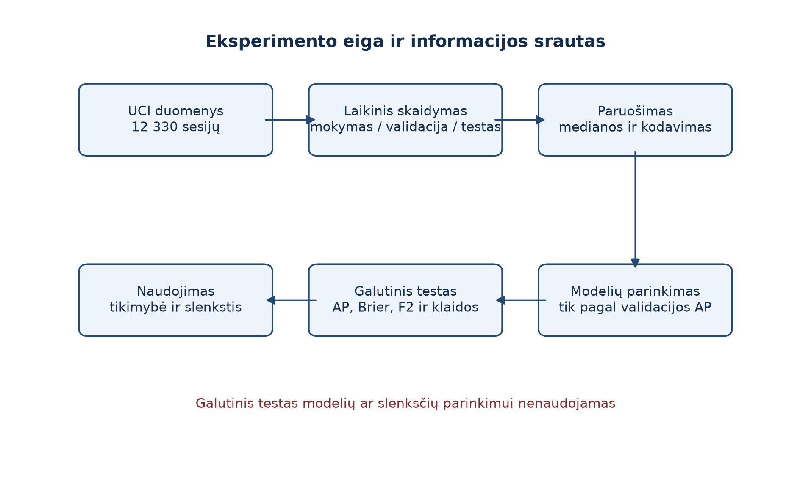
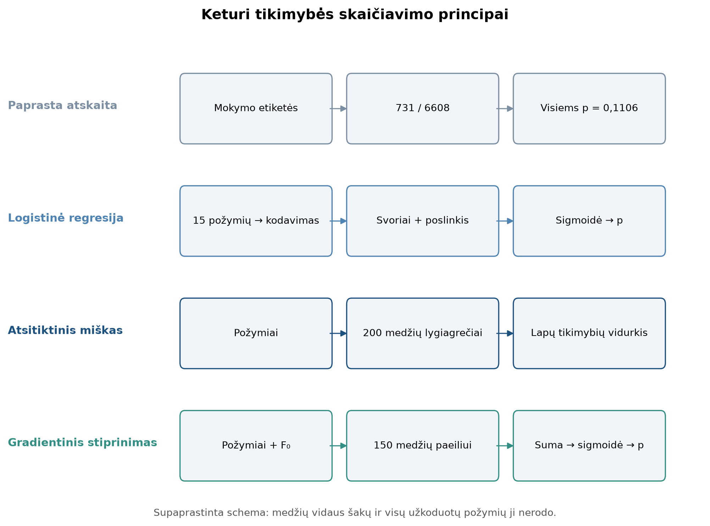
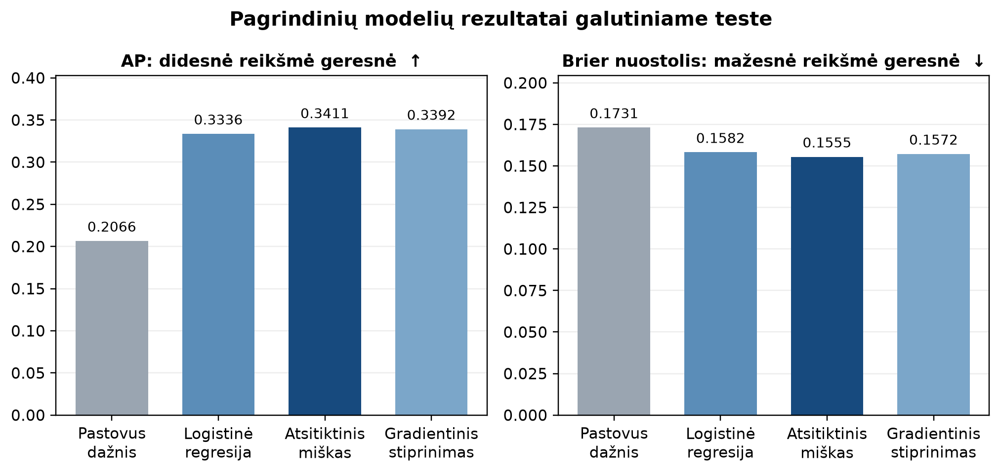
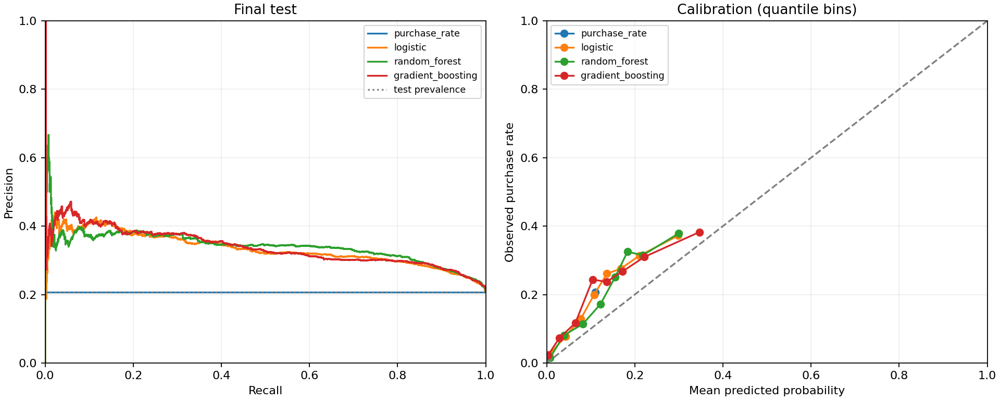

# Elektroninės parduotuvės pirkimo ketinimo tyrimo egzamino ataskaita

**Andrej Kondratjev · DISfm-26 · Intelektualiosios sistemos · 2026**

## 1. Įvadas

Šioje ataskaitoje aprašomas elektroninės parduotuvės sesijos pirkimo ketinimo tyrimas: duomenų gavimas ir paruošimas, modelių mokymas, parinkimas, galutinis vertinimas, klaidų analizė ir praktinio naudojimo ribos. Tyrimo tikslas – pagal užbaigtų sesijų suvestines apskaičiuoti pirkimo tikimybės įvertį ir palyginti, ar atsitiktinis miškas suteikia praktiškai pastebimą pranašumą prieš paprastesnes atskaitas. Šio bandymo požymių prieinamumas dar vykstant naršymui nepatvirtintas. Ataskaitoje pateikiami jau įvykdyto eksperimento rezultatai; visas programos kodas nekartojamas.

Praktinė vertė – galimybė rikiuoti sesijas pagal tikėtiną pirkimą ir nukreipti ribotus veiksmus, pavyzdžiui, konsultanto dėmesį ar priminimą. Prognozė pati savaime nenusako, kokį veiksmą taikyti: tam dar reikia žinoti klaidingo teigiamo sprendimo, praleisto pirkėjo ir intervencijos kainą.

### 1.1. Tyrimo klausimas ir hipotezė

Pagrindinis klausimas: ar modelis, gebantis aprašyti netiesines požymių sąveikas, vėlesnių mėnesių sesijas surikiuoja geriau už logistinę regresiją? Iš anksto nustatyta H1 hipotezė: nenaudojant neaiškaus prieinamumo požymio PageValues, atsitiktinio miško galutinio testo AP turi būti bent 0,02, t. y. 2 procentiniais punktais, didesnė už logistinės regresijos AP.

0,02 buvo iš anksto pasirinkta mokomojo darbo praktiškai pastebimos persvaros riba, kad, pavyzdžiui, 0,002 AP (0,2 procentinio punkto) nebūtų laikoma pakankamu pagrindu rinktis sudėtingesnį mišką. Tai nėra statistinio reikšmingumo slenkstis, universali literatūros norma ar pinigais pagrįsta verslo riba. Jei būtų žinomos FP, FN ir intervencijos kainos, ribą reikėtų sieti su jomis. Todėl išvada vertinama ir pagal porinio bootstrap AP skirtumo intervalą.

## 2. Duomenys ir jų paruošimas

Naudotas UCI Online Shoppers Purchasing Intention duomenų rinkinys (Sakar ir Kastro, 2018). Viena eilutė yra anoniminė internetinės parduotuvės sesijos suvestinė, o tikslas Revenue nurodo, ar sesija baigėsi pirkimu. Rinkinyje yra 12 330 sesijų ir 1 908 pirkimai. Lankytojo identifikatoriaus bei tikslių laiko žymų nėra, todėl mėnuo taikomas tik apytiksliam laikiniam atskyrimui.

**1 lentelė. Laikinis duomenų skaidymas**

| Imtis | Mėnesiai | Sesijos | Pirkimai | Pirkimų dalis |
|---|---|---|---|---|
| Mokymas | Vasaris–rugpjūtis | 6 608 | 731 | 11,06 % |
| Validacija | Rugsėjis–spalis | 997 | 201 | 20,16 % |
| Galutinis testas | Lapkritis–gruodis | 4 725 | 976 | 20,66 % |

Skaidymas sąmoningai imituoja mokymą iš ankstesnių mėnesių ir vertinimą vėlesniu laikotarpiu. Mokymo imties medianos, kategorijų žodynas ir kitos transformacijos apskaičiuojamos tik iš mokymo dalies. Skaitinės tuščios reikšmės pakeičiamos mokymo mediana, kategorinės – mokyme dažniausia reikšme, o kategorijos koduojamos vienkartiniu kodavimu (angl. *one-hot encoding*). Nežinomos vėlesnių imčių kategorijos priimamos be klaidos.

Mokymo imtyje modeliai išmoksta parametrus, validacijoje parenkami hiperparametrai ir sprendimo slenkstis, o testas naudojamas jau užfiksuotam sprendimui įvertinti. Validacija nėra papildoma mokymo imtis: pasirinktas modelis po jos nepermokomas sujungus mokymą ir validaciją.

Lapkričio–gruodžio imtis buvo validus nepriklausomas galutinis testas pirmojo vertinimo metu, nes modeliai, hiperparametrai ir slenksčiai buvo užfiksuoti prieš jį atveriant. Po klaidų, pogrupių, kalibracijos ir slenksčio elgsenos analizės ši imtis tyrėjui jau žinoma. Todėl vėlesni modelio pakeitimai negali būti laikomi nepriklausomai patvirtintais tame pačiame teste; jiems reikia naujo būsimo laikotarpio arba kitos iki tol neliestos holdout imties.

Pagrindiniame variante naudojama 15 pradinių požymių. PageValues pašalintas, nes jo apskaičiavimo momentas duomenų apraše nėra pakankamai aiškus realaus laiko prognozei. Šis požymis grąžinamas tik atskirame jautrumo bandyme. Dabartinis eksperimentas yra užbaigtų sesijų suvestinių offline/post-session klasifikavimas, o ne patvirtintas tarpinės sesijos realaus laiko prognozavimas. Visiškai sutampančios 125 eilutės paliktos, nes suvestinės sutapimas neįrodo, kad tai tas pats lankytojas; jos dėl mėnesio negali kirsti pasirinkto skaidymo ribų.

## 3. Metodai ir eksperimento protokolas

**2 lentelė. Lyginti metodai**

| Metodas | Paskirtis | Parinkti nustatymai |
|---|---|---|
| Pastovus mokymo dažnis | Paprasta atskaita; visoms sesijoms ta pati tikimybė | p = 0,1106 |
| Logistinė regresija | Stipresnė interpretuojama tiesinė atskaita | C = 1 |
| Atsitiktinis miškas | Netiesinės sąveikos ir kelių medžių vidurkis | 200 medžių; min. lapas 20 |
| Gradientinis stiprinimas | Nuosekliai taisomos ankstesnių medžių klaidos | 150 iteracijų; 7 lapai |

Iš viso validacijoje išbandyti 9 iš anksto apibrėžti kandidatai: viena pastovi atskaita, dvi logistinės regresijos (C ∈ {0,1; 1,0}), dvi atsitiktinio miško (min_samples_leaf ∈ {5; 20}), dvi gradientinio stiprinimo (max_leaf_nodes ∈ {7; 15}) ir dvi atsitiktinio miško su PageValues versijos. Tai ribotas hiperparametrų palyginimas validacijos imtyje, o ne išsami optimizacija. Kiekvienoje metodų šeimoje laimėtojas parinktas tik pagal validacijos AP. Galutinis testas iki pasirinkimų užfiksavimo nenaudotas.

Miško 200 medžių ir stiprinimo 150 iteracijų bei mokymosi žingsnis 0,05 buvo nustatyti iš anksto pagal ribotą skaičiavimo biudžetą; optimalumas neįrodytas. Miško medžiai mokomi atskirai, o stiprinimo medžiai kuriami nuosekliai, todėl jų skaičių tiesiogiai lyginti negalima. Atsitiktinių skaičių pradžios reikšmė 42 pasirinkta tik atkuriamumui, ne kokybei gerinti.



*1 pav. Eksperimento eiga ir duomenų atskyrimo principas*

### 3.1. Kaip kiekvienas metodas apskaičiuoja tikimybę

Visi keturi metodai grąžina įvertį intervale [0; 1], bet skiriasi būdu, kuriuo jį gauna. x žymi vienos sesijos pradinius požymius, o z – tą pačią sesiją po mokymo imtyje nustatyto paruošimo. Šios formulės aprašo prognozavimą jau išmokytu modeliu, o ne visą jo mokymo procedūrą.



*2 pav. Keturių metodų principinė struktūra; medžių ir požymių vidus supaprastintas*

Pastovus mokymo pirkimų dažnis (angl. baseline) ignoruoja z ir visoms sesijoms priskiria vienodą mokymo pirkimų dalį (scikit-learn developers, n.d.-b):

$$ \hat p_0=\frac{1}{N}\sum_{i=1}^{N}y_i \tag{1} $$

N = 6 608 – mokymo sesijų skaičius, o yᵢ yra i-osios mokymo sesijos Revenue (1 – pirkta, 0 – nepirkta). Šiame bandyme p₀ = 731 / 6 608 ≈ 0,1106 yra mokymo pirkimų dalis: ją modelis grąžina kaip tikimybę kiekvienai sesijai. Visoms eilutėms skiriamas tas pats balas, todėl baseline jų neranguoja. Jo testo AP = 0,2066 yra testo pirkimų dalis. Baseline AP nėra 0,1106, nes AP skaičiuojama testo imtyje, o pastovaus balo AP lygi vertinamos imties teigiamos klasės daliai.

Logistinė regresija sudeda išmoktų požymių svorių poveikį ir rezultatą paverčia tikimybe sigmoidės funkcija:

$$ \hat p_{\mathrm{LR}}(x)=\frac{1}{1+\exp[-(w^{\mathsf T}z+a)]} \tag{2} $$

w yra iš mokymo duomenų išmoktas požymių svorių vektorius, a – poslinkis; skliaustuose esantis wᵀz + a yra pradinis įvertis. Didesnis C reiškia silpnesnį koeficientų apribojimą; validacija pasirinko C = 1. Tai dvejetainio LogisticRegression predict_proba taisyklė (scikit-learn developers, n.d.-c).

Tai primena vieną neuroną su sigmoidės aktyvavimo funkcija, tačiau paslėptų sluoksnių nėra. Įvestis šiame darbe nėra keturi skaičiai: naudojami 9 skaitiniai ir 6 kategoriniai pradiniai požymiai, o kategorijas užkodavus vektorius z turi daugiau komponentų. 4 įėjimų piešinys būtų tik mokomasis pavyzdys, ne šios programos architektūra.

Atsitiktinis miškas kiekvieną paruoštą sesiją nuveda į kiekvieno medžio lapą; iš ten gautos teigiamos klasės tikimybės suvidurkinamos:

$$ \hat p_{\mathrm{RF}}(x)=\frac{1}{T}\sum_{t=1}^{T}p_t(z) \tag{3} $$

T = 200 – medžių skaičius, pₜ(z) – t-ojo medžio pasiekto lapo mokymo pavyzdžių pirkimų dalis. Tai tikimybių vidurkis, ne balsavimas pagal kiekvieno medžio 0/1 klasę (scikit-learn developers, n.d.-d).

1 pav. rodo viso eksperimento duomenų eigą, o 2 pav. – supaprastintus modelių principus. Miško eilutėje nupiešti žodžiai „200 medžių“ nereiškia vieno konkretaus medžio struktūros: kiekviename iš 200 realių medžių yra daug vidinių skaidymų ir lapų. Todėl schemoje matomas tik medžių lygiagretumas ir jų išvesčių vidurkinimas.

Histograminis gradientinis stiprinimas (angl. histogram-based gradient boosting) iš pradinio įverčio nuosekliai prideda medžių taisymus logaritminių šansų skalėje. Tikimybė gaunama pritaikius sigmoidę:

$$ \hat p_{\mathrm{GB}}(x)=\sigma\!\left(F_0+\eta\sum_{m=1}^{M}h_m(z)\right) \tag{4} $$

F₀ yra mokyme nustatytas pradinis įvertis, hₘ(z) – m-ojo medžio indėlis prieš žingsnio koeficientą, M = 150 – iteracijų skaičius, η = 0,05 – mokymosi žingsnis, σ(u) = 1 / (1 + exp(−u)). Tai skaičiavimo principo užrašas: tikslų lapų reikšmių ir jų taisymų mokymą įgyvendina scikit-learn. Šio modelio medžių tikimybės tiesiogiai nevidurkinamos (scikit-learn developers, n.d.-e).

Skirtingą medžių skaičių lemia jų vaidmuo: miško 200 medžių išmokstami atskirai ir jų prognozės vidurkinamos, o stiprinimo 150 medžių kuriami paeiliui, po vieną mažą taisymą su η = 0,05. Skaičiai 200 ir 150 buvo iš anksto pasirinkti ribotam skaičiavimo biudžetui, o ne kaip vienodo sudėtingumo ar įrodyto optimalaus tikslumo reikšmės. Todėl vien medžių skaičius neleidžia spręsti, kuris modelis geresnis; tai parodo tik atskirtos imties metrikos.

Visiems metodams dvejetainė išvestis gaunama palyginus jų grąžintą pirkimo tikimybę su tos metodų šeimos validacijoje parinktu slenksčiu τ: jei p ≥ τ, prognozė yra 1, kitu atveju – 0. Pastovus modelis slenksčio tinklelyje visus testo įrašus priskyrė teigiamai klasei.

### 3.2. Vertinimo rodikliai

Pagrindinė metrika yra AP (angl. *average precision*). Ji apibendrina teigiamų prognozių tikslumo (angl. *precision*) ir jautrumo (angl. *recall*) ryšį per visus unikalius slenksčius ir gerai tinka retai teigiamai klasei. Jei TP yra teisingai aptikti pirkimai, FP – klaidingai pirkimais pavadintos sesijos, o FN – praleisti pirkimai, tai *precision* = TP / (TP + FP) ir *recall* = TP / (TP + FN). Pirmasis atsako, kokia teigiamų prognozių dalis teisinga, antrasis – kokia tikrų pirkimų dalis aptikta.

$$ AP=\sum_{k}(R_k-R_{k-1})P_k \tag{5} $$

Rₖ ir Pₖ yra *recall* bei *precision* k-ajame prognozės slenkstyje. Didesnė AP reikšmė reiškia geresnį sesijų surikiavimą.

AP atsako, kaip gerai modelis surikiuoja sesijas pagal pirkimo tikimybę. Pagal validacijos AP pasirenkamas kandidatas; ši metrika nepriklauso nuo vieno fiksuoto sprendimo slenksčio. F2 naudojamas tik parinkti slenkstį jau pasirinktam kandidatui. Užfiksavus slenkstį, *precision*, *recall*, F1 ir F2 apibūdina konkrečius dvejetainius sprendimus.

$$ Brier=\frac{1}{n}\sum_{i=1}^{n}(\hat{p}_i-y_i)^2 \tag{6} $$

Čia n – vertintų sesijų skaičius, pᵢ – prognozuota tikimybė, yᵢ ∈ {0,1} – tikras pirkimo faktas. Kai p = 0,9 ir pirkimas įvyksta, kvadratinė klaida maža; kai pirkimo nėra, ji didelė. Brier yra šių klaidų vidurkis, todėl mažesnis geresnis. Jis vertina tikimybines prognozes apskritai; kalibracijos kreivė atskirai lygina prognozes su stebėtais dažniais.

Log loss taip pat vertina tikimybes, bet ypač stipriai baudžia už labai užtikrintas klaidingas prognozes. Mažesnis log loss geresnis; šiame darbe jis yra papildomas rodiklis, ne modelio parinkimo kriterijus.

AP ir trapecinis PR-AUC apibūdina *precision*–*recall* kreivę, bet skaičiuojami skirtingai. Pastoviam modeliui trapecinis plotas čia yra 0,6033 dėl kreivės galinio taško, nors modelis sesijų neranguoja. Todėl pagrindiniam palyginimui naudojama AP, o trapecinis PR-AUC pateikiamas tik papildomai.

Veiksmo slenkstis parenkamas validacijoje maksimizuojant F2. Šiame mokomajame scenarijuje potencialaus pirkėjo praleidimas laikomas mažiau pageidaujamu nei papildomas klaidingas signalas. Tai tinka pigiam veiksmui, pavyzdžiui, priminimui; brangiai nuolaidai ar konsultanto skambučiui toks prioritetas gali netikti. Tikrųjų FP, FN ir intervencijos kainų nėra, todėl F2 nėra įrodytas verslo optimumas.

$$ F_2=\frac{5\,\mathrm{Precision}\,\mathrm{Recall}}{4\,\mathrm{Precision}+\mathrm{Recall}} \tag{7} $$

F2 teikia pirmenybę *recall*: išreikštos per klaidų skaičius formulės vardiklyje FN koeficientas yra 4, o FP – 1 (scikit-learn developers, n.d.-f). Tai projekto taisyklė, o ne universali klaidų kainų proporcija.

Palyginimui F1 vienoje reikšmėje vienodai derina *precision* ir *recall*:

$$ F_1=\frac{2\,\mathrm{Precision}\,\mathrm{Recall}}{\mathrm{Precision}+\mathrm{Recall}} \tag{8} $$

Pakeitus tik skaičiavimo rodiklį iš F2 į F1, to paties modelio prognozės ir TP, FP, FN nepasikeičia; pasikeičia skaitinė vertinimo reikšmė. Jei pagal naują rodiklį iš naujo parenkamas slenkstis validacijoje, gali pasikeisti ir sprendimai, *precision* bei *recall*.

**3 lentelė. Rodiklių paskirtis ir interpretacija**

| Rodiklis | Kam naudojamas | Geriau | Svarbiausia interpretacija |
|---|---|---|---|
| AP | Modelių rangavimo palyginimas | Didesnis | Ne accuracy; nepriklauso nuo vieno slenksčio |
| Precision | Teigiamų sprendimų vertinimas | Didesnis | Kokia prognozuotų pirkimų dalis tikra |
| Recall | Aptiktų pirkimų vertinimas | Didesnis | Kokia tikrų pirkimų dalis rasta |
| F1 | Papildomas sprendimų rodiklis | Didesnis | Vienodai derina precision ir recall |
| F2 | Validacijos slenksčio parinkimas | Didesnis | Teikia pirmenybę recall; ne finansinis optimumas |
| Brier | Tikimybių klaida | Mažesnis | Vidutinė kvadratinė tikimybės klaida |
| Log loss | Papildoma tikimybių klaida | Mažesnis | Stipriai baudžia už užtikrintas klaidas |
| Trapecinis PR-AUC | Papildoma PR kreivės charakteristika | Didesnis | Pastovaus modelio reikšmė gali klaidinti |
| Bootstrap 95 % intervalas | RF ir LR AP skirtumo neapibrėžtumas | — | Jei apima 0, RF persvara neįrodyta |

## 4. Programos realizacija ir prieinamumas

Programa išskaidyta į atskirus modulius: duomenų gavimą, paruošimą, modelius, mokymą, vertinimą, analizę, grafikų kūrimą ir rezultatų įrašymą. Visą eksperimentą paleidžia viena komanda:

```python
python -m src.experiment
```

Ataskaitoje nekartojamas visas kodas. Svarbiausia vieno išmokyto klasifikatoriaus išvesties eilutė yra:

```python
probabilities = model.predict_proba(X)[:, 1]
```

Ji paima teigiamos klasės, t. y. pirkimo, tikimybę kiekvienai sesijai. Toliau tos tikimybės naudojamos AP, Brier, *precision*, *recall* ir klaidų analizei.

### 4.1. GitHub repozitorija

Programos kodas, konfigūracija, testai, rezultatai ir atkūrimo instrukcijos pateikti repozitorijoje: [SanAndriuwa/IS-EGZ-KL](https://github.com/SanAndriuwa/IS-EGZ-KL).

Atkuriamumui užfiksuota Python ir bibliotekų aplinka, atsitiktinių skaičių pradžios reikšmė 42, vienas skaičiavimo srautas, duomenų SHA256 bei pradinio pagrindinio paleidimo programos failų kontrolinės sumos. Vykdymo aprašas saugomas results/manifest.json; po papildomos abliacijos kodo pakeitimo jo kodo sumos nėra dabartinių src/ failų sumos.

## 5. Pagrindiniai rezultatai

**4 lentelė. Pagrindinių modelių galutinio testo rezultatai**

| Modelis | AP | Precision | Recall | Brier |
|---|---|---|---|---|
| Pastovus mokymo dažnis | 0,2066 | 0,2066 | 1,0000 | 0,1731 |
| Logistinė regresija | 0,3336 | 0,2438 | 0,9693 | 0,1582 |
| Atsitiktinis miškas | 0,3411 | 0,2414 | 0,9795 | 0,1555 |
| Gradientinis stiprinimas | 0,3392 | 0,2311 | 0,9877 | 0,1572 |

### Kaip skaityti pagrindinius rezultatus

- Pastovaus modelio AP = 0,2066 atitinka testo pirkimų dalį; jis sesijų neranguoja.
- Logistinės regresijos AP = 0,3336 rodo geresnį pirkimų rangavimą už pastovų modelį.
- RF turi didžiausią stebėtą pagrindinių modelių AP = 0,3411; gradientinio stiprinimo AP = 0,3392 yra labai artima.
- RF ir logistinės regresijos skirtumas 0,0076 yra mažesnis už iš anksto pasirinktą 0,02 ribą.
- Porinio bootstrap intervalas apima 0, todėl tvirto RF pranašumo ši imtis neparodo.

AP yra rodiklis nuo maždaug 0 iki 1: didesnis reiškia geresnį rangavimą, tačiau 0,3411 nereiškia 34,11 % teisingų atsakymų. RF AP viršija pastovaus modelio AP apie 0,1346 (skirtumas skaičiuotas iš neapvalintų reikšmių), o logistinę regresiją – tik 0,0076.



*3 pav. Pagrindinių modelių AP ir Brier palyginimas*

$$ \Delta AP=AP_{RF}-AP_{LR}=0.3411-0.3336=0.0076 \tag{9} $$

RF turi didžiausią stebėtą AP šiame teste, tačiau jo persvara prieš logistinę regresiją tėra 0,0076, t. y. 0,76 procentinio punkto. Tai neįrodo bendro metodo pranašumo.

Porinis bootstrap 500 kartų su grąžinimu perrenka testo eilutes ir kiekvieną kartą abiejų modelių AP skaičiuoja toms pačioms eilutėms. Iš AP_RF − AP_LR skirtumų gautas centrinis 95 % intervalas [−0,0113; 0,0284]. Jis apima 0, todėl šiame bandyme negalima tvirtai teigti, kad RF geresnis; stebėta persvara taip pat nesiekia 0,02, todėl H1 nepatvirtinama. Intervalas nereiškia 95 % tikimybės, kad tikrasis skirtumas būtinai yra jo viduje, ir neapima kitų parduotuvių, sezonų ar naujų mokymo pradžios reikšmių. 500 pakartojimų yra pasirinktas skaičiavimo biudžetas: daugiau pakartojimų galėtų stabilizuoti intervalo ribas, bet 500 nėra privalomas standartas.

### 5.1. Slenkstis ir sumaišties matrica

Atsitiktinio miško 0,03 slenkstis nebuvo ranka parinktas peržiūrėjus testą. Kode tikrintas tinklelis nuo 0,01 iki 0,99 kas 0,01; kiekvienam slenksčiui validacijoje apskaičiuotas F2. Pasirinkto RF didžiausią validacijos F2 davė 0,03. Šis slenkstis užfiksuotas prieš galutinį testą.

Teste gauta TN=745, FP=3 004, FN=20 ir TP=956. Modelis aptiko 956 iš 976 pirkimų, tačiau klaidingai pažymėjo 3 004 nepirkusias sesijas. Jis beveik nepraleidžia pirkėjų, bet teigiamą signalą duoda labai dažnai: *recall* = 0,9795, o *precision* = 0,2414. Didelis *recall* nėra bendras tikslumas.

Prie šio užfiksuoto slenksčio *precision* = 956 / (956 + 3 004) = 0,2414, *recall* = 956 / (956 + 20) = 0,9795, F1 = 0,3874, o F2 = 0,6078. Didesnis F2 šiuo atveju nereiškia, kad modelis pagerėjo: abu balai apskaičiuoti iš tų pačių prognozių, tik F2 labiau vertina didelį *recall*.

**5 lentelė. To paties miško testo prognozės esant dviem iliustraciniams slenksčiams**

| Slenkstis | TP | FP | FN | Precision | Recall | F1 | F2 |
|---|---|---|---|---|---|---|---|
| 0,03 | 956 | 3 004 | 20 | 0,2414 | 0,9795 | 0,3874 | 0,6078 |
| 0,10 | 857 | 2 142 | 119 | 0,2858 | 0,8781 | 0,4312 | 0,6207 |

0,10 eilutė yra tik iliustracija, perskaičiuota pagal jau turimas testo tikimybes: keliant slenkstį sumažėja teigiamų prognozių, praleidžiama daugiau pirkimų, bet sumažėja nereikalingų kontaktų. Teste abiejų F reikšmių padidėjimas nesuteikia teisės pakeisti validacijoje nustatyto 0,03 slenksčio. Norint sąžiningai palyginti F1 ir F2 parenkamus slenksčius, juos reikia atskirai nustatyti išsaugotose validacijos prognozėse arba pakartotinai vykdant mokymą, o tada vieną kartą vertinti tame pačiame teste. Mūsų galutinė AP = 0,3411 nuo šių fiksuotų slenksčių nepriklauso.

### 5.2. Kalibracija



*4 pav. Precision–recall ir tikimybių kalibracijos kreivės*

Atsitiktinis miškas dažniausiai nuvertina pirkimo tikimybę. Pavyzdžiui, vienoje tikimybių grupėje vidutinė prognozė yra 0,183, o tikroji pirkimų dalis – 0,325; aukščiausioje grupėje atitinkamai 0,300 ir 0,379. Tai dera su tuo, kad testiniu laikotarpiu pirkimų dalis buvo didesnė negu mokymo laikotarpiu, tačiau vien šis sutapimas neįrodo priežasties.

## 6. Papildomi bandymai

### 6.1. PageValues jautrumas

Validacijoje parinkto RF testo AP be PageValues buvo 0,3411, o su juo – 0,6715; Brier sumažėjo iki 0,1158. Pirmajame palyginime kartu keitėsi požymis ir validacijoje parinktas lapo dydis: be PageValues jis buvo 20, su juo – 5.

**6 lentelė. Fiksuotų RF parametrų PageValues abliacija**

| Lapo dydis | PageValues | Validacijos AP | Testo AP |
|---|---|---|---|
| 5 | Ne | 0,3063 | 0,3345 |
| 5 | Taip | 0,7070 | 0,6715 |
| 20 | Ne | 0,3070 | 0,3411 |
| 20 | Taip | 0,6904 | 0,6611 |

Fiksuojant lapo dydį 20, testo AP padidėja nuo 0,3411 iki 0,6611; fiksuojant 5 – nuo 0,3345 iki 0,6715. Taigi stiprus signalas išlieka ir nekeičiant šio parametro. Testas nenaudotas variantui pasirinkti. Abliacija atlikta po pirminės testo analizės, todėl yra tiriamoji, o ne naujas nepriklausomas patvirtinimas. Rezultatas neįrodo nei nutekėjimo, nei PageValues prieinamumo realiu laiku; būtina patikrinti jo skaičiavimo langą. Pagrindinė išvada lieka paremta variantu be šio požymio.

### 6.2. Trūkstamų reikšmių atsparumas

**7 lentelė. AP pokytis atsitiktinai paslėpus 9,87 % skaitinių langelių**

| Modelis | Pradinė AP | AP su trūkumais | Pokytis |
|---|---|---|---|
| Logistinė regresija | 0,3336 | 0,3298 | −0,0038 |
| Atsitiktinis miškas | 0,3411 | 0,3386 | −0,0025 |
| Gradientinis stiprinimas | 0,3392 | 0,3360 | −0,0032 |

Iš anksto pasirinktas 10 % skaitinių langelių paslėpimas yra kontroliuojamas atsparumo scenarijus, ne realaus diegimo trūkumo dažnio įvertis. Ta pati atsitiktinė kaukė taikyta visiems pagrindiniams modeliams; dėl atsitiktinės atrankos faktiškai paslėpta 4 197 iš 42 525 langelių, arba 9,87 %. Tikslas – patikrinti vidutinio masto atsitiktinių trūkumų poveikį. Bandymas neapima viso stulpelio dingimo, sisteminio trūkumo ar trūkumo, priklausančio nuo pirkimo klasės.

### 6.3. Pogrupiai ir klaidų pavyzdžiai

Lapkričio atsitiktinio miško AP buvo 0,3868, gruodžio – 0,2900; tuo pat metu pirkimų dalys buvo 25,35 % ir 12,51 %. Kadangi AP priklauso nuo klasės dažnio, šis skirtumas nėra grynas modelio kokybės pablogėjimo matas. Naujiems lankytojams žemas slenkstis visas 754 sesijas priskyrė teigiamai klasei, todėl prieš realų naudojimą būtinas atskiras slenksčio auditas.

**8 lentelė. Tipiniai atsitiktinio miško klaidų pavyzdžiai**

| Šaltinio eilutė | Klaida | Tikimybė | Interpretacija |
|---|---|---|---|
| 10064 | FP | 0,4595 | Intensyvus naršymas, bet nepirkta |
| 11145 | FP | 0,4551 | Naujas lankytojas, bet nepirkta |
| 10615 | FN | 0,0011 | Trumpa sesija, tačiau pirkta |
| 7600 | FN | 0,0052 | Nulinė trukmė, tačiau pirkta |

Klaidos rodo, kad naršymo intensyvumas nėra pirkimo garantija, o trumpa sesija nėra patikimas nesusidomėjimo įrodymas. Nulinė trukmė kartu su pirkimu taip pat kelia duomenų matavimo taisyklių klausimą.

## 7. Klaidų ir nuoseklumo patikra

Prieš rengiant šią ataskaitą rezultatai patikrinti nepriklausomai nuo suvestinio teksto. Visų keturių pagrindinių modelių sumaišties matricų elementai sudaro po 4 725 testines sesijas, o teigiamų klasių suma yra 976. Iš matricų perskaičiuoti *precision* ir *recall* sutampa su metrics.csv. Skaidymo lentelėje sesijų suma yra 12 330, o pirkimų – 1 908. Dubliuotų modelio ir scenarijaus rezultatų eilučių nėra.

Paleisti 8 automatiniai testai; visi baigėsi sėkmingai. Jie tikrina laiko tvarką, imčių atskyrimą, neleistinų požymių pašalinimą, mokymo medianas, naujas kategorijas ir tuščias reikšmes, atsitiktinio miško formulę, AP savybę, slenkstį, blogą įvestį ir UTF‑8 rezultatų įrašymą. Eksperimento manifeste užfiksuotas 6,45 s vykdymo laikas autoriaus Windows aplinkoje. Ankstesniame ataskaitos juodraštyje buvo likę pasenę teiginiai apie 9,4 s ir 7 testus; šioje redakcijoje jie ištaisyti.

Duomenų SHA256 sutampa su naudotu CSV. manifest.json programos kontrolinės sumos aprašo pradinį pagrindinį paleidimą, o ne dabartinius src/ failus po papildomos abliacijos; atskirame pakartotiniame paleidime visi pagrindinių variantų AP tiksliai sutapo su išsaugotais rezultatais. Atsitiktinio miško medžių tikimybių vidurkio bei bibliotekos predict_proba išvesties didžiausias absoliutus skirtumas teste yra 0. Skaitinių prieštaravimų tarp manifest.json, metrics.csv, split_summary.csv ir šioje ataskaitoje pateiktų pagrindinių rezultatų nerasta.

## 8. Diskusija ir ribotumai

UCI aprašymas nurodo, kad puslapių skaičius ir trukmė gali būti atnaujinami naršant, tačiau pateiktas CSV neturi tarpinių momentinių kopijų. Todėl galutinių sesijos suvestinės reikšmių prieinamumas konkrečiu realaus laiko prognozės momentu nėra įrodytas.

**9 lentelė. Požymių prieinamumas prognozės momentu**

| Požymis | Ką reiškia | Kada atsiranda | Tarpiniu momentu | Pabaigos rizika |
|---|---|---|---|---|
| Administrative | Administracinių puslapių skaičius | Kaupiasi naršant | Galutinė reikšmė negarantuota | Vidutinė |
| Administrative_Duration | Laikas administraciniuose puslapiuose | Kaupiasi naršant | Galutinė reikšmė negarantuota | Vidutinė |
| Informational | Informacinių puslapių skaičius | Kaupiasi naršant | Galutinė reikšmė negarantuota | Vidutinė |
| Informational_Duration | Laikas informaciniuose puslapiuose | Kaupiasi naršant | Galutinė reikšmė negarantuota | Vidutinė |
| ProductRelated | Produktų puslapių skaičius | Kaupiasi naršant | Galutinė reikšmė negarantuota | Vidutinė |
| ProductRelated_Duration | Laikas produktų puslapiuose | Kaupiasi per sesiją | Galutinė reikšmė negarantuota | Didelė |
| BounceRates | Puslapių atmetimo rodiklių agregatas | Analitikos sistemoje | CSV neįrodo prieinamumo | Didelė |
| ExitRates | Puslapių išėjimo rodiklių agregatas | Analitikos sistemoje | CSV neįrodo prieinamumo | Didelė |
| SpecialDay | Datos artumas specialiai dienai | Žinomas iš kalendoriaus | Taip | Maža |
| PageValues | Puslapių komercinės vertės agregatas | Analitikos sistemoje | CSV neįrodo prieinamumo | Labai didelė |

Revenue nepatenka į įvestį, o PageValues pašalintas iš pagrindinio varianto, tačiau vien tai neįrodo, kad temporalinis informacijos nutekėjimas visiškai pašalintas. Galutinės trukmės, BounceRates ir ExitRates taip pat reikalauja kilmės ir prieinamumo audito.

- Duomenys apima vieną anoniminę parduotuvę ir vienų metų laikotarpį, todėl išvados automatiškai neperkeliamos kitoms parduotuvėms ar sezonams.
- Mėnuo suteikia tik apytikslę laiko tvarką; nėra tikslių laiko žymų ir lankytojo identifikatoriaus.
- Pirkimų dalis mokyme ir teste skiriasi beveik du kartus, todėl tikimybės vėlesniais mėnesiais yra prasčiau kalibruotos.
- Mažas iš anksto nustatytas parametrų tinklas riboja skaičiavimo sąnaudas, bet neįrodo, kad rasta geriausia įmanoma kiekvieno metodo versija.
- PageValues, sesijos trukmės, BounceRates ir ExitRates prieinamumas prognozės momentu turi būti audituojamas prieš realaus laiko naudojimą.
- Bootstrap intervalas aprašo šio testo ir jau išmokytų modelių neapibrėžtumą; jis neapima kitų mokymo pradžios reikšmių ar būsimų laikotarpių.

## 9. Išvados

- Mokomi modeliai rikiavo pirkimus geriau už pastovų modelį (AP = 0,2066). RF turėjo didžiausią stebėtą pagrindinių modelių AP – 0,3411 – ir mažiausią Brier nuostolį – 0,1555.
- Jo AP persvara prieš logistinę regresiją buvo 0,0076, o 95 % bootstrap intervalas [−0,0113; 0,0284], todėl iš anksto nustatyta bent 0,02 persvaros hipotezė nepatvirtinta.
- Validacijoje parinktas 0,03 slenkstis aptiko 956 iš 976 pirkimų, bet sukūrė 3 004 klaidingus teigiamus atvejus. Aukštas recall gautas mažo precision kaina; prieš naudojimą reikia žinoti klaidų kainas arba veiksmų biudžetą.
- PageValues suteikė stiprų prognozavimo signalą ir esant vienodam RF lapo dydžiui, tačiau jo laikinė kilmė nepatvirtinta, todėl jis neįtrauktas į pagrindinę išvadą.
- Programa patikrinta 8 automatiniais testais. Rezultatai pagrindžia offline/post-session tyrimą; realaus laiko taikymui reikia požymių prieinamumo audito ir naujo būsimo laikotarpio testo.

## 10. Šaltiniai

1. Breiman, L. (2001). Random Forests. Machine Learning, 45, 5–32. https://doi.org/10.1023/A:1010933404324
2. Cawley, G. C., Talbot, N. L. C. (2010). On Over-fitting in Model Selection and Subsequent Selection Bias in Performance Evaluation. Journal of Machine Learning Research, 11, 2079–2107. https://www.jmlr.org/papers/v11/cawley10a.html
3. Friedman, J. H. (2001). Greedy Function Approximation: A Gradient Boosting Machine. The Annals of Statistics, 29(5), 1189–1232. https://doi.org/10.1214/aos/1013203451
4. Kapoor, S., Narayanan, A. (2022). Leakage and the Reproducibility Crisis in ML-based Science. arXiv. https://doi.org/10.48550/arXiv.2207.07048
5. Niculescu-Mizil, A., Caruana, R. (2005). Predicting Good Probabilities with Supervised Learning. ICML. https://www.cs.cornell.edu/~alexn/papers/calibration.icml05.crc.rev3.pdf
6. Pedregosa, F. ir kt. (2011). Scikit-learn: Machine Learning in Python. Journal of Machine Learning Research, 12, 2825–2830. https://www.jmlr.org/papers/v12/pedregosa11a.html
7. Saito, T., Rehmsmeier, M. (2015). The Precision-Recall Plot Is More Informative than the ROC Plot When Evaluating Binary Classifiers on Imbalanced Datasets. PLOS ONE, 10(3), e0118432. https://doi.org/10.1371/journal.pone.0118432
8. Sakar, C. O., Kastro, Y. (2018). Online Shoppers Purchasing Intention Dataset. UCI Machine Learning Repository. https://doi.org/10.24432/C5F88Q
9. Sakar, C. O. ir kt. (2019). Real-time prediction of online shoppers’ purchasing intention using multilayer perceptron and LSTM recurrent neural networks. Neural Computing and Applications, 31, 6893–6908. https://doi.org/10.1007/s00521-018-3523-0
10. scikit-learn developers (n.d.-a). average_precision_score documentation (version 1.8). https://scikit-learn.org/1.8/modules/generated/sklearn.metrics.average_precision_score.html
11. scikit-learn developers (n.d.-b). DummyClassifier (version 1.8). https://scikit-learn.org/1.8/modules/generated/sklearn.dummy.DummyClassifier.html
12. scikit-learn developers (n.d.-c). Logistic Regression (version 1.8). https://scikit-learn.org/1.8/modules/linear_model.html#logistic-regression
13. scikit-learn developers (n.d.-d). RandomForestClassifier (version 1.8). https://scikit-learn.org/1.8/modules/generated/sklearn.ensemble.RandomForestClassifier.html
14. scikit-learn developers (n.d.-e). HistGradientBoostingClassifier (version 1.8). https://scikit-learn.org/1.8/modules/generated/sklearn.ensemble.HistGradientBoostingClassifier.html
15. scikit-learn developers (n.d.-f). fbeta_score documentation (version 1.8). https://scikit-learn.org/1.8/modules/generated/sklearn.metrics.fbeta_score.html
